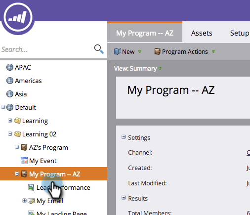

# Clonare una risorsa in un programma {#clone-an-asset-in-a-program}

Clonazione di un programma duplicati _tutto_. A volte ti basta clonare una risorsa. Ecco come.

>[!NOTE]
>
>Dovrai eseguire ulteriori passaggi per [clonare un gruppo di test di una pagina di destinazione](/help/marketo/product-docs/demand-generation/landing-pages/landing-page-actions/cloning-a-landing-page-test-group.md).

## Clonare una risorsa locale {#clone-a-local-asset}

1. Vai a **Marketing** **Attività**.

   

1. Seleziona il programma.

   

1. Fai clic con il pulsante destro del mouse sulla risorsa locale da clonare. Clic **Clona**.

   

1. Ogni tipo di risorsa presenta una finestra di dialogo diversa. Compila le informazioni e fai clic su **Clona**.

   

   >[!TIP]
   >
   >Puoi anche clonare una risorsa in un altro programma. Utilizza il **Programma** per effettuare la selezione.

1. Fantastico! Ora dovresti visualizzare la nuova risorsa clonata.

   

   >[!NOTE]
   >
   >[Clona un programma](/help/marketo/product-docs/core-marketo-concepts/programs/working-with-programs/clone-a-program.md)
