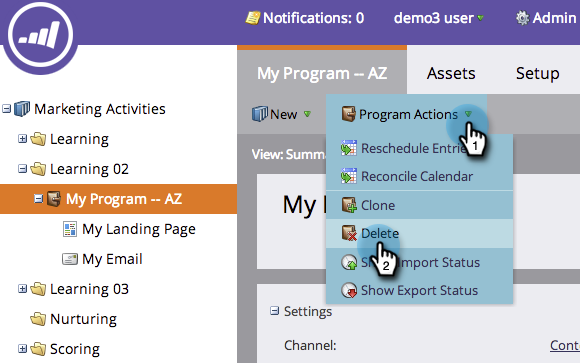
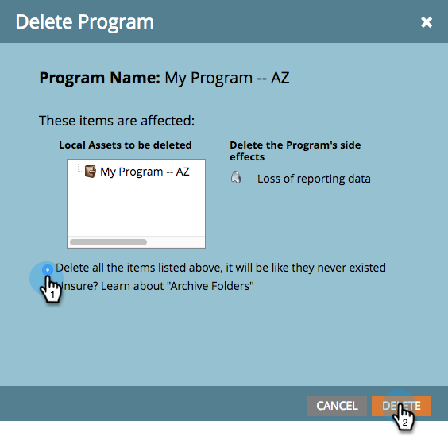

# Eliminare un programma {#delete-a-program}

È possibile archiviare un programma, ma a volte si vuole solo sbarazzarsene definitivamente. Ecco come.

1. Selezionare il programma da eliminare.

1. Fare clic su **Azioni programma**. Fare clic su **Elimina**.

   

1. Seleziona l’opzione Elimina tutto . Esamina gli effetti collaterali dell&#39;eliminazione del programma, quindi fai clic su **Elimina** per confermare.

>[!TIP]
>
>**L&#39;archiviazione** dei programmi consente di ottimizzare i dati del programma, ma rende il programma impossibile. Selezionare questa opzione, quindi fare clic su **Avanti** per visualizzare ulteriori dettagli sull&#39;archiviazione.

Completato. È come se il programma non fosse mai esistito.

## Perché non posso eliminare il mio programma? {#why-cant-i-delete-my-program}

I programmi possono contenere risorse utilizzate altrove nel sistema, impedendo l’eliminazione di un programma.

Per risolvere il problema, potrebbe essere necessario approfondire e annullare l’approvazione/eliminazione. Segui questi passaggi.

1. Fai clic sul collegamento per passare alla risorsa.

   

1. Fai clic su **Utilizzato da** per vedere dove si trova la risorsa.

   

   Una volta che sai dove viene utilizzata la risorsa, accedi e annulla l’approvazione o la cancellazione. Quindi prova a eliminare nuovamente il programma.
