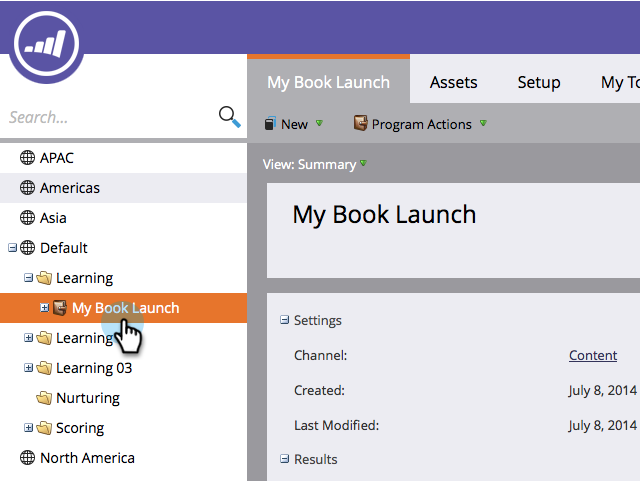

# Modificare le impostazioni comportamento di Analytics {#edit-analytics-behavior-settings}

Scopri come modificare il comportamento di Analytics a livello di programma.

1. Passa a **[!UICONTROL Marketing Activities]**.

   

1. Individuare e selezionare il programma.

   

1. Nella scheda **[!UICONTROL Setup]**, trascina [!UICONTROL Analytics Behavior] nell&#39;area di lavoro.

   

1. Seleziona il comportamento di Analytics desiderato.

   

>[!NOTE]
>
>**Definizione**
>
>**[!UICONTROL Inclusive]** - Questa opzione garantisce che il programma sia disponibile per la generazione di rapporti in Esplora ricavi e analizzatori indipendentemente dal fatto che sia stato incluso o meno un costo del periodo.
>
>**[!UICONTROL Operational]** - Con questa opzione il programma non viene visualizzato in Esplora ricavi o negli analizzatori.

>[!NOTE]
>
>Il comportamento predefinito (se questa impostazione non viene applicata) è che il programma viene incluso in Analytics SOLO se è presente almeno un costo periodo, anche uno a cui sono assegnati zero dollari.

1. Fai clic su **[!UICONTROL Save]**.

   

Il comportamento di analisi è stato sostituito a livello di programma.

>[!NOTE]
>
>Le modifiche diventeranno effettive il giorno successivo e il programma sarà reso disponibile o ritirato da Revenue Explorer e Analyzer.
