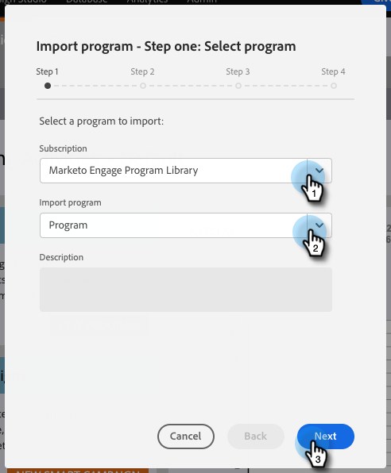

# Importare un programma {#import-a-program}

Un programma può essere importato da un abbonamento Marketo a un altro. Ad esempio, puoi creare un programma in una sandbox e importarlo nell’abbonamento live. È inoltre possibile importare un programma predefinito dalla libreria dei programmi Marketo.

## Importazione di un programma {#importing-a-program}

1. Vai a **Attività di marketing.**

   

1. Fai clic su **Nuovo** a discesa. Seleziona **Programma di importazione**.

   

   >[!NOTE]
   >
   >Importazione programma è disponibile solo per gli utenti per i quali è abilitata l’autorizzazione Importa programma. Ulteriori informazioni [gestione di ruoli e autorizzazioni utente](/help/marketo/product-docs/administration/users-and-roles/managing-user-roles-and-permissions.md).
   >
   >Per collegare un account sandbox al tuo abbonamento live, contatta [Supporto Marketo](https://nation.marketo.com/t5/Support/ct-p/Support).

1. Selezionare un Marketo **Abbonamento** e un programma da importare. Fai clic su **Successivo**.

   

1. Specifica una **Cartella campagna** per il programma importato. Fai clic su **Avanti.**

   

   >[!NOTE]
   >
   >Assicurati **Usa conflitto predefinito** regole selezionate. Le regole di conflitto sono necessarie quando si importano programmi in un’istanza con risorse dello stesso nome.

1. Scegli i dettagli di conflitto desiderati e fai clic su **Successivo**.

   

   >[!NOTE]
   >
   >Importazione di un programma che utilizza passaggi di flusso personalizzati o regole di elenchi avanzati derivate da un servizio di passaggi del flusso in un&#39;istanza di destinazione in cui sono presenti più provider di servizi compatibili, all&#39;utente importatore verrà richiesto di assegnare passaggi o regole al provider di servizi corretto nell&#39;istanza di destinazione.

1. Anteprima dettagli e **Importa** il programma.

   

Al termine dell’importazione riceverai un messaggio e-mail di conferma.

>[!NOTE]
>
>Sarà necessario ripianificare le campagne batch importate e attivare le campagne di attivazione. Il sistema disattiva automaticamente le pianificazioni delle campagne e attiva le campagne nel programma importato.

## Impatto sulle attività esterne durante le importazioni del programma {#impact-on-external-assets-during-program-imports}

I programmi utilizzano risorse esterne come modelli e-mail, modelli di pagina di destinazione, immagini, moduli, token e tag di programma. È possibile configurare la modalità di gestione dei modelli di pagina di destinazione e dei tag di programma e Marketo gestisce automaticamente il resto.

**Modelli di pagina di destinazione/e-mail:** I modelli e-mail/pagina di destinazione vengono importati in Design Studio. È possibile utilizzare regole di conflitto per configurare il comportamento quando esiste un modello con lo stesso nome. Utilizzando la regola predefinita, a un modello verrà aggiunto un numero se ne esiste uno con lo stesso nome. Ad esempio, se disponi già di un modello denominato &quot;Modello standard&quot;, il nuovo verrà denominato &quot;Modello standard - 1&quot;.

**Pagine di destinazione/Forms:** Se in Design Studio esiste un modulo o una pagina di destinazione con lo stesso nome, verranno comunque importati, ma con un numero aggiunto al nome (ad esempio: Pagina di destinazione - 1).

**Immagini:** Le immagini utilizzate dalle pagine di destinazione vengono importate nello studio di progettazione, a meno che non ne esista una con lo stesso nome.

**Token:** I token che risiedono al di fuori di un programma verranno convertiti in token locali durante il processo di importazione.

>[!CAUTION]
>
>I token di tipo immagine non sono supportati per le importazioni di programmi. Se viene importato un programma con tipo immagine, i miei token **no** passeranno dei token.

**Tag del programma:** È possibile utilizzare regole di conflitto per controllare il modo in cui verranno trattati i tag di programma non esistenti nell&#39;account di destinazione. Utilizzando la regola predefinita verranno creati i tag del programma oppure è possibile scegliere di ignorarli.

>[!CAUTION]
>
>Durante l’importazione di un programma, invia e-mail/pagine di destinazione che contengono [contenuto dinamico](/help/marketo/product-docs/personalization/segmentation-and-snippets/segmentation/understanding-dynamic-content.md) verranno saltate.
