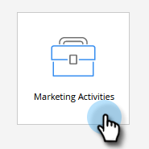

# Importare un programma {#import-a-program}

Un programma può essere importato da un abbonamento Marketo a un altro. Ad esempio, puoi creare un programma in una sandbox e quindi importarlo nel tuo abbonamento live. È inoltre possibile importare un programma predefinito dalla libreria dei programmi di Marketo.

## Importazione di un programma {#importing-a-program}

1. Vai a **Attività di marketing.**

   

1. Clic **Nuovo** a discesa. Seleziona **Importa programma**.

   

   >[!NOTE]
   >
   >Importazione programmi è disponibile solo per gli utenti che dispongono di ruoli con l&#39;autorizzazione Importazione programmi abilitata. Ulteriori informazioni su [gestione di ruoli utente e autorizzazioni](/help/marketo/product-docs/administration/users-and-roles/managing-user-roles-and-permissions.md).
   >
   >Per collegare un account sandbox al tuo abbonamento live, contatta [Supporto Marketo](https://nation.marketo.com/t5/Support/ct-p/Support).

1. Seleziona un Marketo **Abbonamento** e un programma da importare. Clic **Successivo**.

   

1. Specifica un **Cartella campagna** per il programma importato. Clic **Avanti.**

   

   >[!NOTE]
   >
   >Assicurati che **Usa conflitto predefinito** regole è selezionato. Le regole di conflitto sono necessarie quando si importano programmi in un&#39;istanza con risorse con lo stesso nome.

1. Scegli i dettagli del conflitto desiderati e fai clic su **Successivo**.

   

   >[!NOTE]
   >
   >Quando si importa un programma che utilizza i passaggi di flusso personalizzati o le regole di elenchi avanzati derivate da un servizio di passaggi di flusso in un&#39;istanza di destinazione in cui è presente più di un provider di servizi compatibile, all&#39;utente di importazione viene richiesto di assegnare i passaggi o le regole al provider di servizi corretto nell&#39;istanza di destinazione.

1. Dettagli anteprima e **Importa** il programma.

   

Al termine dell’importazione riceverai una conferma e-mail.

>[!NOTE]
>
>Dovrai riprogrammare le campagne batch importate e attivare le campagne trigger. Il sistema disattiva automaticamente le pianificazioni delle campagne e attiva le campagne nel programma importato.

## Impatto sulle risorse esterne durante le importazioni del programma {#impact-on-external-assets-during-program-imports}

I programmi utilizzano risorse esterne come modelli e-mail, modelli di pagine di destinazione, immagini, moduli, token e tag di programma. Puoi configurare la modalità di gestione dei modelli di pagina di destinazione e dei tag del programma e Marketo gestisce automaticamente il resto.

**Modelli di pagina di destinazione/e-mail:** I modelli di e-mail/pagina di destinazione vengono importati in Design Studio. È possibile utilizzare le regole di conflitto per configurare il comportamento quando esiste un modello con lo stesso nome. Utilizzando la regola predefinita, a un modello viene aggiunto un numero se ne esiste già uno con lo stesso nome. Ad esempio, se disponi già di un modello denominato &quot;Modello standard&quot;, il nuovo sarà denominato &quot;Modello standard - 1&quot;.

**Pagine di destinazione/Forms:** Se in Design Studio esiste un modulo o una pagina di destinazione con lo stesso nome, questi verranno comunque importati, ma con un numero aggiunto al nome (ad esempio, Pagina di destinazione - 1).

**Immagini:** Le immagini utilizzate dalle pagine di destinazione vengono importate nello studio di progettazione a meno che non esista una con lo stesso nome.

**Token:** I token che risiedono al di fuori di un programma verranno convertiti in token locali durante il processo di importazione.

>[!CAUTION]
>
>I token di tipo immagine non sono supportati per le importazioni di programmi. Se viene importato un programma con tipo di immagine i miei token, **no** i token passeranno attraverso.

**Tag programma:** Puoi utilizzare le regole di conflitto per controllare il modo in cui verranno trattati i tag del programma che non esistono nell’account di destinazione. L’utilizzo della regola predefinita creerà i tag del programma oppure puoi scegliere di ignorarli.

>[!CAUTION]
>
>Durante l’importazione di un programma, e-mail/pagine di destinazione contenenti [contenuto dinamico](/help/marketo/product-docs/personalization/segmentation-and-snippets/segmentation/understanding-dynamic-content.md) verrà ignorato.
