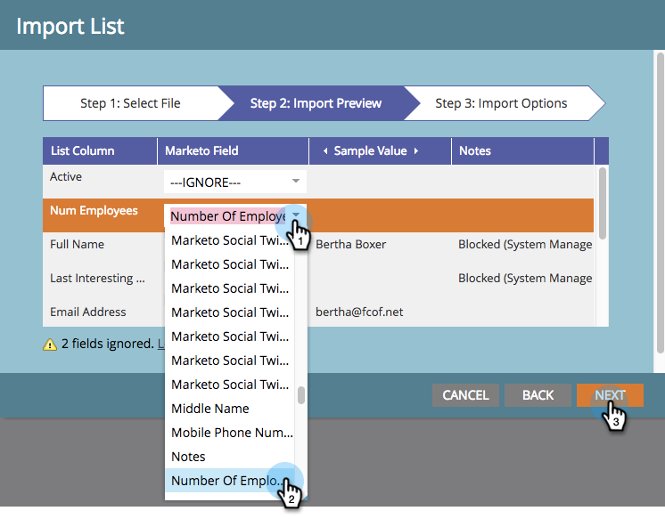

# Importare membri da un foglio di calcolo in un programma {#import-members-from-a-spreadsheet-into-a-program}

Puoi importare un elenco di persone che diventano automaticamente membri di un programma. Ecco cosa fare.

## Preparare il file CSV {#prepare-your-csv-file}

1. Creare un file CSV standard in [!DNL Excel], come nell'esempio seguente.

   

   >[!CAUTION]
   >
   >Quando importi una data in un campo data, utilizza questo formato: 9/29/24 (Mese/Giorno/Anno).

## Importare il file CSV in Marketo {#import-your-csv-into-marketo}

1. Nel programma, passare alla sezione **[!UICONTROL Members]**.

   

1. Fai clic su **[!UICONTROL Import Members]**.

   

1. Selezionare il file CSV e fare clic su **[!UICONTROL Next]**.

   

1. Mappare i valori dei dati dall'elenco ai campi Marketo corrispondenti e fare clic su **[!UICONTROL Next]**.

   

   >[!NOTE]
   >
   >Se sono presenti campi che non si desidera importare, selezionare **[!UICONTROL IGNORE]** nel menu a discesa Campo Marketo.

1. Selezionare **[!UICONTROL Member Status]** per l'elenco.

   

1. Fai clic su **[!UICONTROL Import]**.

   

1. Attendi che Marketo completi l’importazione, quindi chiudi la finestra di dialogo di conferma.

   

   Fantastico! Dovresti visualizzare i nuovi membri importati.

   

>[!MORELIKETHIS]
>
>[Gestisci e visualizza membri](/help/marketo/product-docs/core-marketo-concepts/programs/working-with-programs/manage-and-view-members.md){target="_blank"}
