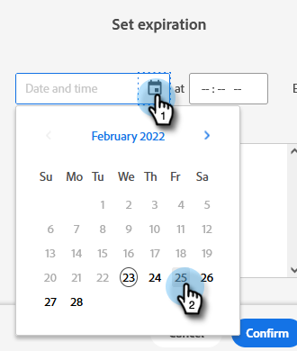

# Scadenza risorse locali {#local-asset-expiration}

Imposta una data/ora di scadenza per annullare la pubblicazione delle pagine di destinazione, disattivare l’attivazione delle campagne o interrompere le campagne batch ricorrenti.

## Autorizzazione per la scadenza della risorsa della pianificazione {#grant-schedule-asset-expiration-permission}

Prima di pianificare la scadenza di una risorsa, è necessario che il ruolo Marketo disponga dell’autorizzazione appropriata abilitata.

>[!NOTE]
>
>**Autorizzazioni amministratore richieste**

1. In [!UICONTROL Amministratore] area, fai clic su **[!UICONTROL Utenti e ruoli]**.

   

1. Fai clic sul pulsante **[!UICONTROL Ruoli]** selezionare l&#39;utente a cui si desidera concedere l&#39;accesso, quindi fare clic su **[!UICONTROL Modifica ruolo]**.

   

1. Sotto [!UICONTROL Accedere alle attività di marketing], seleziona **[!UICONTROL Pianificazione scadenza risorsa]**. Fai clic su **[!UICONTROL Salva]**.

   

## Imposta una data di scadenza {#set-an-expiration-date}

1. Fai clic con il pulsante destro del mouse sul programma desiderato e seleziona **[!UICONTROL Imposta scadenza risorsa locale]**.

   

1. Controlla le risorse per le quali vuoi impostare una data di scadenza, quindi fai clic su **[!UICONTROL Imposta scadenza]**.

   

1. Scegli una data di scadenza.

   

1. Imposta un&#39;ora. È necessario pianificare un orario di almeno 20 minuti in futuro (non dimenticare di inserire AM/PM). Fai clic su **[!UICONTROL Conferma]** al termine.

   

>[!NOTE]
>
>* Per modificare una data di scadenza esistente, controlla semplicemente le risorse e fai clic su **[!UICONTROL Imposta scadenza]**.
>* Una volta scaduta, la risorsa non verrà più visualizzata nella griglia di scadenza. La griglia visualizza solo le pagine di destinazione pubblicate, le campagne attive e le campagne batch ricorrenti.

## Rimuovere una data di scadenza {#remove-an-expiration-date}

1. Per rimuovere una data di scadenza, controlla le risorse e fai clic su **[!UICONTROL Rimuovi scadenza]**.

   

1. Esamina le risorse interessate, quindi fai clic su **[!UICONTROL Conferma]**.

   

>[!NOTE]
>
>Non è possibile rimuovere le date di scadenza inferiori a 15 minuti nel futuro. Per &quot;rimuovere&quot; la scadenza, è necessario attendere che la risorsa scada, quindi riapprovarla o riattivarla.
