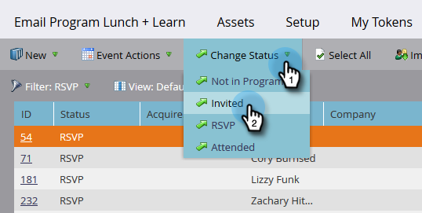
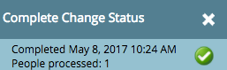

# Gestisci e visualizza membri {#manage-and-view-members}

È possibile gestire e visualizzare i membri nei programmi utilizzando la scheda Membri.

>[!NOTE]
>
>Approfondisci [iscrizione al programma](/help/marketo/product-docs/core-marketo-concepts/programs/creating-programs/understanding-program-membership.md).

## Cerca un membro {#search-for-a-member}

Nella parte inferiore della sezione Membri, utilizzare il campo di ricerca per cercare i membri del programma per nome, e-mail, titolo del lavoro o società.

1. Fai clic sul pulsante **Membri** scheda del programma.

   

1. Utilizzare il campo di ricerca per cercare l&#39;elenco dei membri.

   

## Esporta griglia membri {#export-the-members-grid}

È possibile esportare l&#39;elenco dei membri facendo clic sull&#39;icona Excel accanto al campo di ricerca.

## Gestisci colonne nella griglia dei membri {#manage-columns-in-the-members-grid}

Trascinare le colonne per modificarne l’ordine. La coppia di frecce blu indica dove andrà la colonna.

Fai clic con il pulsante destro del mouse sull’intestazione della colonna per ordinare in ordine alfabetico, crescente o decrescente.

## Scegliere le colonne visibili nella griglia {#choose-which-columns-are-visible-in-the-grid}

1. Fai clic sul pulsante **Visualizza** a discesa e seleziona **Crea visualizzazione**.

   

1. Assegna un nome alla visualizzazione personalizzata. Selezionare i titoli delle colonne. Fai clic su **Aggiungi** e **Rimuovi** per spostare le colonne e creare una visualizzazione.

   

1. Fai clic su **Crea**.

   

## Filtrare la griglia dei membri  {#filter-the-members-grid}

1. Fai clic sul pulsante **Filtro** e seleziona un passaggio di progressione in base al quale eseguire l’ordinamento.

   

## Gestisci stato persona nella griglia dei membri {#manage-person-status-in-the-members-grid}

È possibile modificare lo stato delle persone all&#39;interno della griglia dei membri.

1. Tenere premuto **Ctrl/Comando** e seleziona le persone.

   

1. Fai clic sul pulsante **Cambia stato** e seleziona uno stato.

   

   Questo può richiedere un momento. Vedrai il messaggio qui sotto quando è tutto finito!

   

Tante caratteristiche, ma sono tutte abbastanza semplici. Godetevi!

>[!MORELIKETHIS]
>
>[Creare un rapporto sulle prestazioni del programma](/help/marketo/product-docs/core-marketo-concepts/programs/program-performance-report/create-a-program-performance-report.md)
