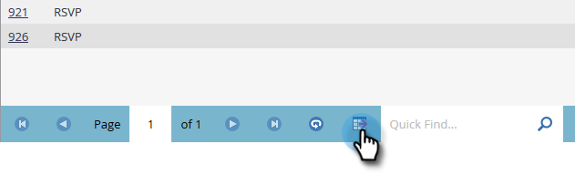
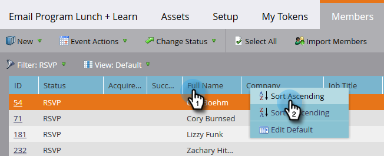

# Gestione e visualizzazione dei membri {#manage-and-view-members}

È possibile gestire e visualizzare i membri nei programmi utilizzando la scheda Membri.

>[!NOTE]
>
>**FYI**
>
>Marketo sta standardizzando la lingua tra tutte le iscrizioni, pertanto è possibile che nell&#39;abbonamento siano presenti lead/lead e persone in docs.marketo.com. Questi termini significano la stessa cosa; non influisce sulle istruzioni dell&#39;articolo. Ci sono anche altri cambiamenti. [Ulteriori](http://docs.marketo.com/display/DOCS/Updates+to+Marketo+Terminology)informazioni.

>[!NOTE]
>
>**Tubo profondo**
>
> Approfondisci l&#39;iscrizione [al](../../../../product-docs/core-marketo-concepts/programs/creating-programs/understanding-program-membership.md)programma.

## Cerca un membro {#search-for-a-member}

Nella parte inferiore della sezione Membri, utilizzate il campo di ricerca per cercare i membri del programma per nome, e-mail, titolo del processo o società.

1. Fare clic sulla scheda **Membri** del programma.

   

1. Utilizzare il campo di ricerca per cercare nell&#39;elenco dei membri.

   

## Esportare la griglia dei membri {#export-the-members-grid}

Per esportare l’elenco dei membri, fai clic sull’icona Excel accanto al campo di ricerca.

## Gestisci colonne nella griglia dei membri {#manage-columns-in-the-members-grid}

* Trascinare le colonne per modificarne l’ordine. La coppia di frecce blu indica dove andrà la colonna.

   

* Fate clic con il pulsante destro del mouse sull’intestazione della colonna per ordinare l’ordine alfabetico, crescente o decrescente.

   

## Scegliere le colonne visibili nella griglia {#choose-which-columns-are-visible-in-the-grid}

1. Fare clic sul menu a discesa **View **e selezionare **Crea vista**.

   

1. Denominate la visualizzazione personalizzata. Selezionate i titoli delle colonne. Fare clic su** Aggiungi **** e rimuovi **per spostare le colonne e creare una vista.

   

1. Fate clic su **Crea**.

   

## Filtrare la griglia dei membri  {#filter-the-members-grid}

1. Fate clic sul menu a discesa **Filtro** e selezionate un passaggio di avanzamento per l’ordinamento.

   

## Gestisci stato persona nella griglia dei membri {#manage-person-status-in-the-members-grid}

Potete modificare lo stato delle persone all’interno della griglia dei membri.

1. Tenere premuto **Ctrl/Comando** e selezionare le persone.

   

1. Fate clic sul menu a discesa **Modifica stato** e selezionate uno stato.

   

   Questo potrebbe richiedere un momento. Vedrai il messaggio qui sotto quando è tutto fatto!

   

Tante caratteristiche, ma sono tutte abbastanza semplici. Divertiti!

>[!MORELIKETHIS]
>
>* [Creare un rapporto sulle prestazioni del programma](../../../../product-docs/core-marketo-concepts/programs/program-performance-report/create-a-program-performance-report.md)

>

