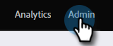
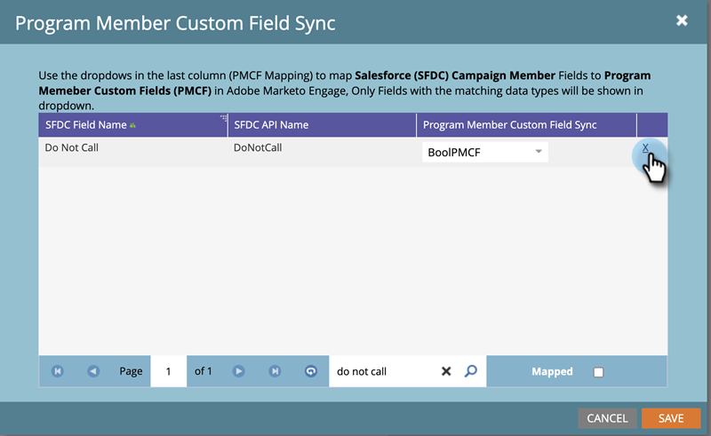

# Sincronizzazione campo personalizzata membro del programma {#program-member-custom-field-sync}

>[!PREREQUISITES]
>
>* Creazione di [Campi personalizzati membri del programma](/help/marketo/product-docs/core-marketo-concepts/programs/working-with-programs/program-member-custom-fields.md){target=&quot;_blank&quot;}
>* [Sincronizzazione di una campagna Salesforce con un programma](/help/marketo/product-docs/core-marketo-concepts/programs/working-with-programs/sync-an-sfdc-campaign-with-a-program.md){target=&quot;_blank&quot;}

>[!NOTE]
>
>L&#39;oggetto membro del programma può contenere fino a 20 campi personalizzati. Tali campi sono disponibili per qualsiasi programma.

## Mappatura campi Salesforce su campi personalizzati dei membri del programma {#map-salesforce-fields-to-program-member-custom-fields}

1. In Marketo, fai clic su **Amministratore**.

   

1. Fai clic su **Salesforce**, quindi fai clic su **Modifica** accanto a Sincronizzazione campo personalizzata membro del programma.

   

1. Utilizzare la casella di ricerca per individuare i campi Salesforce che si desidera mappare. In questo esempio, stiamo utilizzando Do Not Call.

   

1. Fai clic sull’elenco a discesa.

   

1. Scegli il campo personalizzato del membro del programma Marketo desiderato da mappare.

   

   >[!NOTE]
   >
   >L’elenco a discesa visualizza solo i campi personalizzati dei membri del programma che corrispondono al tipo di dati del campo Salesforce.

1. Per ulteriori mappature dei campi, deselezionare la casella di ricerca e ripetere i passaggi da 3 a 5.

1. Fai clic su **Salva** al termine.

   

   >[!IMPORTANT]
   >
   >Le modifiche ai dati dei membri del programma nei campi mappati verranno sincronizzate tra Marketo e Salesforce in futuro.

   >[!NOTE]
   >
   >Se rinomini o modifichi il tipo di dati di un campo in Salesforce, verranno rimosse eventuali mappature di tale campo con il campo personalizzato del membro del programma. Tuttavia, puoi riutilizzarlo con il nuovo campo dopo la revisione.

## Annulla mappatura campi Salesforce dai campi personalizzati dei membri del programma {#unmap-salesforce-fields-from-program-member-custom-fields}

Se si desidera liberare un campo per sostituirlo o apportare una modifica generale, è necessario prima eseguire una rimozione dalla mappatura. Ecco come.

1. In Marketo, fai clic su **Amministratore**.

   

1. Fai clic su **Salesforce**, quindi fai clic su **Modifica** accanto a Sincronizzazione campo personalizzata membro del programma.

   

1. Utilizzare la casella di ricerca per individuare i campi da demappare. In questo esempio, stiamo utilizzando Do Not Call.

   

   >[!TIP]
   >
   >È possibile selezionare la **Mappata** per visualizzare solo i campi mappati.

1. Annulla mappatura facendo clic sul pulsante **X** accanto al campo .

   

1. La mappatura viene ora rimossa. Fai clic su **Salva**.

   

## Mappatura del tipo di dati {#data-type-mapping}

<table>
  <colgroup>
    <col/>
    <col/>
  </colgroup>
  <tbody>
    <tr>
      <th>Tipo di dati SFDC</th>
      <th>Tipo di dati campo personalizzato membro del programma</th>
    </tr>
    <tr>
      <td>Testo</td>
      <td>Stringa</td>
    </tr>
    <tr>
      <td>Elenco a discesa</td>
      <td>Stringa</td>
    </tr>
    <tr>
      <td>Selezione multipla</td>
      <td>Stringa</td>
    </tr>
    <tr>
      <td>Telefono</td>
      <td>Stringa</td>
    </tr>
    <tr>
      <td>E-mail</td>
      <td>Stringa</td>
    </tr>
    <tr>
      <td>Numero(m)</td>
      <td>Intero</td>
    </tr>
    <tr>
      <td>Numero(m,n)</td>
      <td>Mobile</td>
    </tr>
    <tr>
      <td>Casella di controllo</td>
      <td>Booleano</td>
    </tr>
    <tr>
      <td>URL</td>
      <td>URL</td>
    </tr>
    <tr>
      <td>Data</td>
      <td>Data</td>
    </tr>
    <tr>
      <td>Datetime</td>
      <td>Datetime</td>
    </tr>
    <tr>
      <td>Ricerca (riferimento)</td>
      <td>Stringa</td>
    </tr>
    <tr>
      <td>Base64</td>
      <td>Stringa</td>
    </tr>
  </tbody>
</table>

>[!MORELIKETHIS]
>
>* [Modifica dati dei membri del programma](/help/marketo/product-docs/core-marketo-concepts/smart-campaigns/program-flow-actions/change-program-member-data.md){target=&quot;_blank&quot;}
>* [Visualizzare i dati sulla griglia dei membri del programma](/help/marketo/product-docs/core-marketo-concepts/programs/working-with-programs/manage-and-view-members.md){target=&quot;_blank&quot;}
>* [Sincr. SFDC - Sincronizzazione campagna](/help/marketo/product-docs/crm-sync/salesforce-sync/sfdc-sync-details/sfdc-sync-campaign-sync.md){target=&quot;_blank&quot;}

