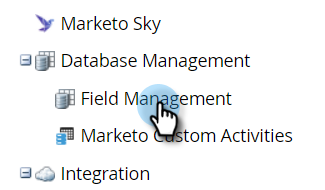

# Campi personalizzati membri del programma {#program-member-custom-fields}

I campi personalizzati dei membri del programma consentono di raccogliere dati specifici per ciascun membro. Possono essere utilizzati in: Moduli Marketo, filtri e attivatori dell’elenco avanzato e azioni di flusso di Smart Campaign. I dati sono visualizzabili nella scheda Membri del programma.

>[!NOTE]
>
>Al momento i campi personalizzati dei membri del programma non dispongono di un’integrazione con i campi membri della campagna Salesforce.

## Creare un campo personalizzato per un membro del programma {#create-a-program-member-custom-field}

1. In Marketo, fai clic su **Amministratore**.

   

1. Fai clic su **Gestione dei campi**.

   

1. Fai clic su **Nuovo campo personalizzato**.

   

1. Fare clic sull’elenco a discesa Oggetto e selezionare l’oggetto desiderato.

   

   >[!NOTE]
   >
   >I campi personalizzati Persona e Membro programma non possono condividere lo stesso nome.

1. Compila i campi rimanenti e fai clic su **Crea**.

   

   >[!NOTE]
   >
   >I tipi supportati per i campi personalizzati dei membri del programma sono: booleano, data, datetime, float, integer, stringa, URL. [Ulteriori informazioni sui tipi di campo](/help/marketo/product-docs/administration/field-management/custom-field-type-glossary.md).

## Descrizioni oggetto {#object-descriptions}

| Oggetto | Descrizione |
|---|---|
| Azienda | Nome della società associata alla persona. |
| Opportunità | Un&#39;opportunità può essere associata a una persona o un account come potenziale vendita futura. Di solito entrano in Marketo tramite una gestione delle relazioni con i clienti o tramite API. |
| Persona | Persona nel database Marketo con cui ti interessi tramite campagne di marketing. |
| Membro del programma | Persona che è anche membro di un programma |

## Triggers e filtri {#triggers-and-filters}

Puoi sfruttare questi dati specifici del programma in elenchi smart tramite [trigger](/help/marketo/product-docs/core-marketo-concepts/smart-campaigns/creating-a-smart-campaign/define-smart-list-for-smart-campaign-trigger.md) e/o [filtri](/help/marketo/product-docs/core-marketo-concepts/smart-lists-and-static-lists/creating-a-smart-list/find-and-add-filters-to-a-smart-list.md).

## Cose da sapere {#things-to-know}

* I campi personalizzati dei membri del programma sono disponibili solo nelle risorse locali. Non sono supportati in Design Studio perché non è possibile collegarli a un programma specifico.
* Non è possibile clonare/spostare in Design Studio un modulo (o una pagina di destinazione con un modulo) contenente campi personalizzati per i membri del programma.
* L&#39;oggetto membro del programma può contenere fino a 20 campi personalizzati. Tali campi sono disponibili per qualsiasi programma.
* Quando si rimuove un membro di un programma, se nel campo personalizzato Membro programma sono presenti dati, i dati verranno eliminati da tale campo.
* Per visualizzare i dati, fare clic sulla scheda Membri nel programma e creare una visualizzazione personalizzata che includa tali campi.
* Importazione ed esportazione tramite [elenco](/help/marketo/getting-started/quick-wins/import-a-list-of-people.md) e [API](https://developers.marketo.com/) sono supportati.
* Quando si uniscono due persone, vengono utilizzati i dati dei campi personalizzati dei membri del programma vincitori. Ma se il vincitore non ne ha, verrà utilizzato il valore del perdente.
* Cambia tipo: **not** consentito nei campi Informazioni membro programma.

>[!MORELIKETHIS]
>
>[Creare un campo personalizzato in Marketo](/help/marketo/product-docs/administration/field-management/create-a-custom-field-in-marketo.md)
