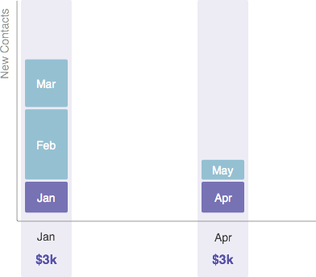

# Informazioni sui costi del periodo {#understanding-period-costs}

## Panoramica {#overview}

I costi di periodo si riferiscono ai soldi spesi in un mese specifico per un programma.

>[!NOTE]
>
>**Esempio**
>
>Se spendi $1000 per noleggiare un illustratore per un eBook che viene lanciato in luglio - il programma eBook avrebbe un costo di periodo di $1000 in luglio.
>
>Se spendi $200 al mese su Google Adwords - il programma Google Adwords avrebbe un costo di $200 **ogni mese**.

>[!NOTE]
>
>[Informazioni sui programmi](/help/marketo/product-docs/core-marketo-concepts/programs/creating-programs/understanding-programs.md)
>
>[Informazioni sull’appartenenza al programma](/help/marketo/product-docs/core-marketo-concepts/programs/creating-programs/understanding-program-membership.md)

## Calcolo dei costi del periodo {#how-period-costs-are-calculated}

Immaginate un evento, come un webinar, che si svolge a marzo. Nuove persone sono acquisite in anticipo dalla pubblicità a gennaio e febbraio. I nuovi contatti vengono anche acquisiti dopo l&#39;evento, quando le persone scaricano il webinar nei mesi di aprile e maggio.

1. Con un unico periodo di costo attribuito a marzo...

   

   ...i contatti aggiunti nei mesi precedenti e successivi saranno *conteggiati solo* verso marzo.

   

1. Con i costi di periodo attribuiti a gennaio, febbraio e marzo...

   

   ...I contatti aggiunti solo nei mesi successivi a marzo saranno conteggiati verso marzo.

   

1. Con i costi di periodo attribuiti a gennaio e aprile...

   

   ...I contatti aggiunti nei mesi da gennaio a marzo saranno conteggiati verso gennaio. I contatti aggiunti nei mesi di aprile e maggio saranno conteggiati verso aprile.

   

   >[!NOTE]
   >
   >In sintesi - i mesi senza un periodo definito i costi passeranno &quot;indietro&quot; all&#39;ultimo che è stato definito. Se non vi è alcun costo del periodo precedente, i mesi verranno &quot;inoltrati&quot; a quello successivo che è stato definito. Se non è stato definito un costo del periodo per _qualsiasi_ mesi, la generazione di rapporti in RCE non sarà disponibile per il programma.

   >[!MORELIKETHIS]
   >
   >* [Utilizzo dei costi del periodo in un programma](/help/marketo/product-docs/core-marketo-concepts/programs/working-with-programs/using-period-costs-in-a-program.md)
   >* [Filtrare un rapporto del programma per costo del periodo](/help/marketo/product-docs/core-marketo-concepts/programs/program-performance-report/filter-a-program-report-by-period-cost.md)

