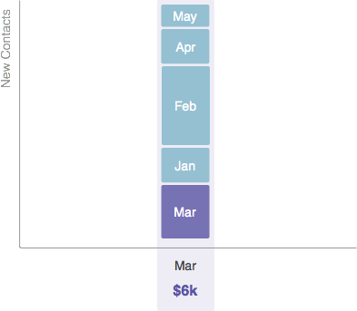
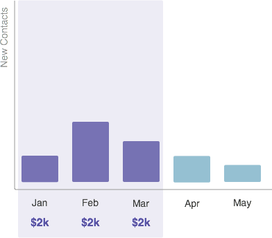

# Informazioni sui costi del periodo {#understanding-period-costs}

## Panoramica {#overview}

I costi del periodo si riferiscono al denaro speso in un mese specifico per un programma.

>[!NOTE]
>
>**Esempio**
>
>Se si spendono $ 1000 per assumere un illustratore per un [!DNL eBook] che viene avviato a luglio, il programma [!DNL eBook] avrebbe un costo di periodo di $ 1000 a luglio.
>
>Se spendi 200 dollari al mese per [!DNL Google Adwords], il programma [!DNL Google Adwords] avrà un costo di periodo di 200 dollari _ogni mese_.

>[!NOTE]
>
>[Informazioni sui programmi](/help/marketo/product-docs/core-marketo-concepts/programs/creating-programs/understanding-programs.md)
>
>[Informazioni sull&#39;iscrizione al programma](/help/marketo/product-docs/core-marketo-concepts/programs/creating-programs/understanding-program-membership.md)

## Modalità di calcolo dei costi del periodo {#how-period-costs-are-calculated}

Immaginate un evento, come un webinar, che si verifica a marzo. Le nuove persone vengono acquisite in anticipo dalla pubblicità nei mesi di gennaio e febbraio. Nuovi contatti vengono acquisiti anche dopo l&#39;evento, quando le persone scaricano il webinar nei mesi di aprile e maggio.

1. Con un solo periodo di costo attribuito a marzo...

   

   ...i contatti aggiunti nei mesi precedenti e successivi contano _solo_ per marzo.

   

1. Con i costi del periodo attribuiti a gennaio, febbraio e marzo...

   

   ...i contatti aggiunti solo nei mesi successivi a marzo saranno conteggiati verso marzo.

   

1. Con i costi del periodo attribuiti a gennaio e aprile...

   

   ...i contatti aggiunti nei mesi da gennaio a marzo saranno conteggiati per gennaio. I contatti aggiunti nei mesi di aprile e maggio saranno conteggiati per aprile.

   

   >[!NOTE]
   >
   >In sintesi: se per un mese non è definito alcun periodo, i costi verranno riportati all&#39;ultimo periodo definito. Se non è presente alcun costo del periodo precedente, i mesi verranno riportati &quot;in avanti&quot; al successivo periodo definito. Se per _qualsiasi_ mesi non è stato definito un costo per il periodo, il reporting in RCE non sarà disponibile per il programma.

   >[!MORELIKETHIS]
   >
   >* [Utilizzo dei costi del periodo in un programma](/help/marketo/product-docs/core-marketo-concepts/programs/working-with-programs/using-period-costs-in-a-program.md)
   >* [Filtrare un report di programma per costo periodo](/help/marketo/product-docs/core-marketo-concepts/programs/program-performance-report/filter-a-program-report-by-period-cost.md)
