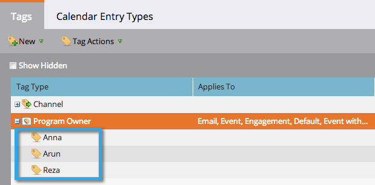

# Tag {#understanding-tags}

Probabilmente ora sapete che i programmi sono come mattoni di costruzione a Marketo. L’utilizzo di tag e canali vi aiuterà a filtrare i dati a scopo di reporting.

I tag vengono utilizzati per descrivere i programmi. Potete creare quanti ne avete bisogno, ciascuno con valori univoci. I canali identificano il meccanismo di consegna in un programma, ad esempio webinar, sponsorizzazione o annunci online.

## Tipo di tag {#tag-type}

I tipi di tag identificano il tipo di informazioni da ordinare.

>[!TIP]
>
>Per creare tag personalizzati, rivolgiti all&#39; [Amministratore marketing](http://docs.marketo.com/display/DOCS/Create+Custom+Tags).

>[!NOTE]
>
>**Esempio**
>
>* Tipo di tag = Proprietario programma

>

## Valore tag {#tag-value}

Ogni tipo di tag avrà dei valori tra cui scegliere.

>[!NOTE]
>
>**Esempio**
>
>* Valori tag = Anna, Arun, Reza

>

## Canale {#channel}

I canali vengono utilizzati per segnalare il modo in cui i [membri](../../../../product-docs/core-marketo-concepts/programs/creating-programs/understanding-program-membership.md) si sono spostati all&#39;interno del programma. Ogni canale ha un set di stati di progressione e uno stato impostato su uguale successo.

>[!NOTE]
>
>**Esempio**
>
>* Canale = Roadshow
   >
   >
* Stato progressione = Invitato, Registrato, Partecipato, Nessuna Mostra
>* Successo = Partecipato

>

>[!MORELIKETHIS]
>
>* [Crea tag personalizzati](../../../../product-docs/administration/tags/create-custom-tags.md)
>* [Creare un canale di programma](../../../../product-docs/administration/tags/create-a-program-channel.md)

>

