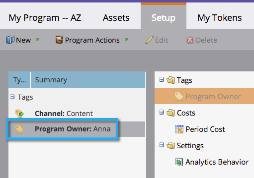

# Utilizzare i tag in un programma {#use-tags-in-a-program}

I tag sono attributi che descrivono i programmi e vengono utilizzati per raggruppare i tipi di programmi nel reporting.

>[!NOTE]
>
>Se si utilizza Gestione ciclo ricavi, è necessario definire un costo periodo (anche se è 0) affinché il rapporto sia disponibile per il programma.

## Utilizzare un tag in un programma {#use-a-tag-in-a-program}

1. Seleziona il programma. Fai clic su **[!UICONTROL Setup]**.

   

1. Trascina un tag nell’area di lavoro.

   

1. Seleziona un valore dal menu a discesa.

   

1. Fai clic su **[!UICONTROL Save]**.

   

1. Proprio così. Il nuovo tag verrà visualizzato nell’area di lavoro.

   

## Modificare un tag {#edit-a-tag}

1. Passa alla scheda **[!UICONTROL Setup]**. Fai clic con il pulsante destro del mouse sul tag. Seleziona **[!UICONTROL Edit]**.

   

1. Fai clic sul menu a discesa. Seleziona un nuovo valore.

   

1. Fai clic su **[!UICONTROL Save]**.

   

1. Fantastico! Dovresti vedere le modifiche nell’area di lavoro.

   

## Eliminare un tag  {#delete-a-tag}

1. Passa alla scheda **[!UICONTROL Setup]**. Fare clic con il pulsante destro del mouse sul tag e selezionare **[!UICONTROL Delete]**.

   

1. Fai clic su **[!UICONTROL Delete]** per confermare.

   

Ottimo lavoro. I programmi con tag coerenti semplificano notevolmente l&#39;esecuzione dei report.
