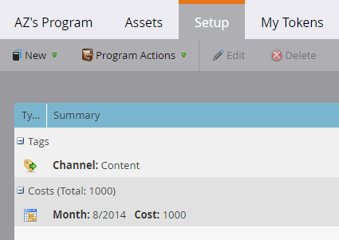

# Utilizzo dei costi del periodo in un programma {#using-period-costs-in-a-program}

A [costo periodo](/help/marketo/product-docs/core-marketo-concepts/programs/working-with-programs/understanding-period-costs.md) è l&#39;importo che si spende per un programma. Può essere per uno o più mesi ed è utilizzato per la generazione di rapporti sul ROI.

## Aggiungi un costo periodo  {#add-a-period-cost}

1. Vai a **Configurazione** del programma.

   

1. Trascina **Costo periodo** nell’area di lavoro.

   

1. Fai clic sull’icona del calendario. Seleziona un mese. Clic **OK**.

   

1. Immetti un **Costo periodo** (senza decimali o virgole). Clic **Salva**.

   >[!NOTE]
   >
   >Può essere una stima. È sempre possibile modificare un costo del periodo una volta che si conosce l&#39;importo esatto (vedere la sezione successiva).

   

1. Il costo viene visualizzato nel programma.

   

   >[!TIP]
   >
   >Puoi trascinare i costi di più periodi nell’area di lavoro. Questo consente di attribuire più mesi con costi di periodo diversi al programma.

## Modifica costo periodo {#edit-a-period-cost}

1. Se si spendono più o meno soldi di quanto originariamente previsto, è possibile modificare il costo del periodo.

1. Vai a **Configurazione** del programma.

   

1. Fai clic con il pulsante destro del mouse sulla **Costo periodo**. Seleziona **Modifica**.

   

1. Apporta le modifiche necessarie. Clic **Salva**.

   

## Eliminare un costo periodo {#delete-a-period-cost}

1. Vai a **Configurazione** del programma.

   

1. Fai clic con il pulsante destro del mouse sulla **Costo periodo**. Seleziona **Elimina**.

   

1. Clic **Elimina** per confermare.

   

>[!MORELIKETHIS]
>
>* [Informazioni sui costi del periodo](/help/marketo/product-docs/core-marketo-concepts/programs/working-with-programs/understanding-period-costs.md)
>* [Filtrare un rapporto Programma per costo periodo](/help/marketo/product-docs/core-marketo-concepts/programs/program-performance-report/filter-a-program-report-by-period-cost.md)
