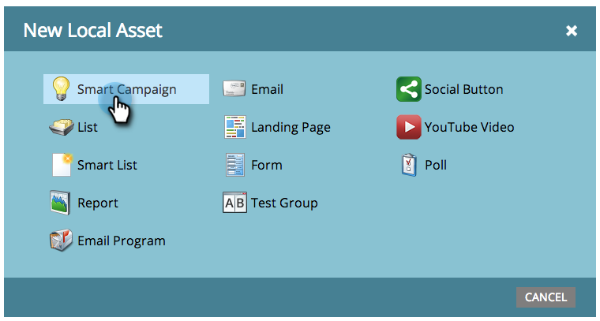
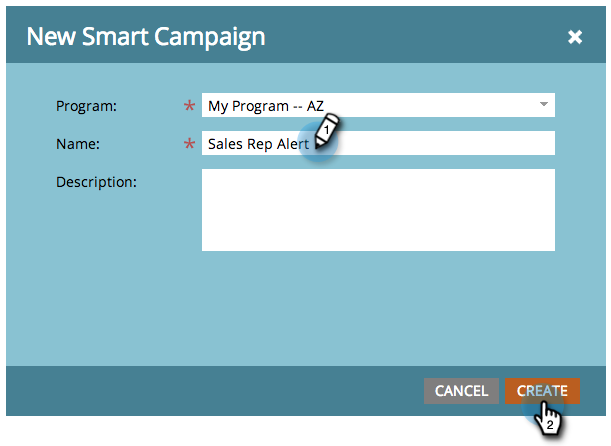

# Creare una nuova campagna avanzata {#create-a-new-smart-campaign}

Le campagne intelligenti sono lo strumento più importante in Marketo. Possono attivarsi su una persona ed eseguire azioni, oppure eseguire il rollup di milioni di persone ed eseguire una serie di passaggi di flusso.

>[!NOTE]
>
>Le campagne intelligenti sono fantastiche. Ulteriori informazioni [qui](/help/marketo/product-docs/core-marketo-concepts/smart-campaigns/understanding-smart-campaigns.md).

1. Vai a **Attività di marketing**.

   

1. Scegli un **Programma** e quindi sotto **Nuovo** fare clic su **Nuova risorsa locale**.

   

   >[!TIP]
   >
   >Puoi creare campagne avanzate come risorse locali di qualsiasi programma.

1. Fai clic su **Smart Campaign**.

   

1. Inserisci il nome della campagna intelligente e fai clic su **Crea**.

   

   Calmo! Successivamente, scopri come definire quali persone eseguire attraverso la campagna intelligente con un elenco smart.

   >[!MORELIKETHIS]
   >
   >* [Definire un elenco avanzato per Smart Campaign | Batch](/help/marketo/product-docs/core-marketo-concepts/smart-campaigns/creating-a-smart-campaign/define-smart-list-for-smart-campaign-batch.md)
   >* [Definire un elenco avanzato per Smart Campaign | Trigger](/help/marketo/product-docs/core-marketo-concepts/smart-campaigns/creating-a-smart-campaign/define-smart-list-for-smart-campaign-trigger.md)

