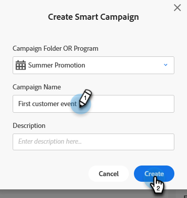

# Creare una nuova campagna avanzata {#create-a-new-smart-campaign}

Le campagne intelligenti sono lo strumento più importante nel Marketo Engage. Possono essere attivati da una sola persona ed eseguire azioni, oppure aggregare milioni di persone ed eseguire una serie di passaggi di flusso.

>[!TIP]
>
>Ulteriori informazioni su [Campagne avanzate](/help/marketo/product-docs/core-marketo-concepts/smart-campaigns/understanding-smart-campaigns.md){target="_blank"}.

1. Vai a **Attività di marketing**.

   

1. Fai clic con il pulsante destro del mouse sul programma desiderato e seleziona (Condividi) **Nuova campagna avanzata**.

   

   >[!TIP]
   >
   >Puoi creare campagne avanzate come risorse locali di qualsiasi programma.

1. Immetti il nome della campagna avanzata e fai clic su **Crea**.

   

   Successivamente, scopri come definire quali persone eseguire in Smart Campaign con un elenco avanzato.

   >[!MORELIKETHIS]
   >
   >* [Definire un elenco avanzato per Smart Campaign | Lotto](/help/marketo/product-docs/core-marketo-concepts/smart-campaigns/creating-a-smart-campaign/define-smart-list-for-smart-campaign-batch.md){target="_blank"}
   >* [Definire un elenco avanzato per Smart Campaign | Attivatore](/help/marketo/product-docs/core-marketo-concepts/smart-campaigns/creating-a-smart-campaign/define-smart-list-for-smart-campaign-trigger.md){target="_blank"}
