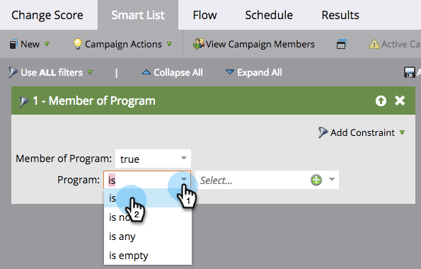
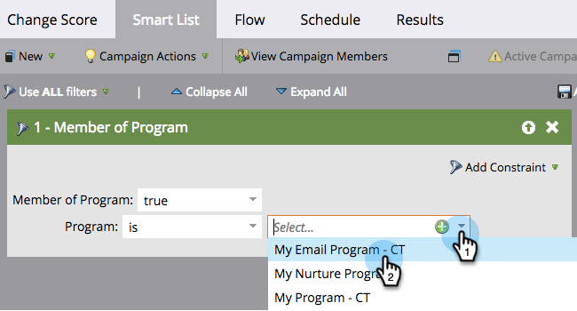

# Definire un elenco avanzato per Smart Campaign | Batch {#define-smart-list-for-smart-campaign-batch}

Gli elenchi avanzati sono il meccanismo utilizzato in Marketo per definire &quot;chi&quot; (quali persone) includere, sia che si tratti di un rapporto, di un elenco o di una campagna avanzata. Ecco come definire un Smart List per una campagna batch.

1. Scegli una campagna avanzata, quindi fai clic su **Elenco avanzato**.

   

1. Digita per cercare un filtro e trascinalo nell’area di lavoro. Ripeti l’operazione per più filtri.

   

   >[!NOTE]
   >
   >Viene eseguita una campagna avanzata con solo i filtri **Batch** modalità. Trova le persone nel database che si qualificano in base ai filtri e le esegue tutte in una sola volta nel flusso.

   >[!NOTE]
   >
   >Puoi eseguire una campagna avanzata su una persona alla volta in base agli eventi live aggiungendo dei trigger, che inseriscono la campagna avanzata in **Trigger** modalità.

1. Fai clic sull’elenco a discesa e scegli un operatore di filtro per il filtro scelto.

   

   >[!CAUTION]
   >
   >Le linee rosse strizzate indicano errori o informazioni mancanti. Se non viene corretta, la campagna non sarà valida e non verrà eseguita.

1. Immetti il valore del filtro.

   

   >[!NOTE]
   >
   >Per impostazione predefinita, le persone che soddisfano TUTTE le regole dell’elenco avanzato sono qualificate. Può essere modificato in base alle esigenze della campagna. Consulta  [Regole di elenco avanzate per la logica complessa](/help/marketo/product-docs/core-marketo-concepts/smart-lists-and-static-lists/using-smart-lists/using-advanced-smart-list-rule-logic.md) per saperne di più.

   Per attivare eventi live una persona alla volta, scopri come [Definire un elenco avanzato per Smart Campaign | Trigger](/help/marketo/product-docs/core-marketo-concepts/smart-campaigns/creating-a-smart-campaign/define-smart-list-for-smart-campaign-trigger.md).

   >[!MORELIKETHIS]
   >
   >* [Definire un elenco avanzato per Smart Campaign | Trigger](/help/marketo/product-docs/core-marketo-concepts/smart-campaigns/creating-a-smart-campaign/define-smart-list-for-smart-campaign-trigger.md)
   >* [Aggiungere un passaggio di flusso a una campagna avanzata](/help/marketo/product-docs/core-marketo-concepts/smart-campaigns/flow-actions/add-a-flow-step-to-a-smart-campaign.md)

