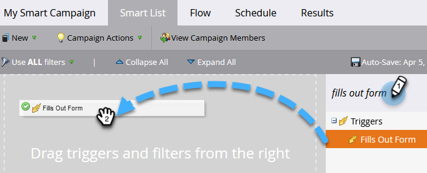
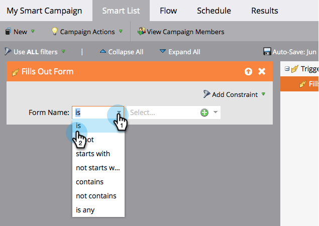
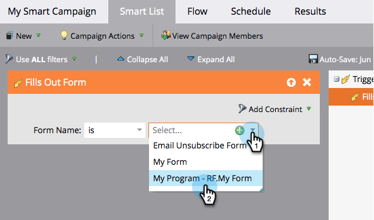

# Definire un elenco avanzato per campagna avanzata | trigger {#define-smart-list-for-smart-campaign-trigger}

Fai in modo che una campagna avanzata venga eseguita su una persona alla volta in base agli eventi live aggiungendo trigger.

>[!CAUTION]
>
>Apportare modifiche a un elenco avanzato o a una fase del flusso in una campagna attiva può potenzialmente comprometterne la funzionalità. Se scegli di farlo, procedi con cautela.

1. In Smart Campaign, fare clic sulla scheda **[!UICONTROL Smart List]**.

   

1. Cerca il trigger desiderato e trascinalo sull’area di lavoro.

   

   >[!NOTE]
   >
   >Una campagna avanzata con trigger viene eseguita in modalità _Trigger_. Viene eseguito su una persona alla volta in base agli eventi attivati ed eventuali filtri aggiuntivi.

   >[!IMPORTANT]
   >
   >Quando utilizzi un campo booleano in un elenco avanzato di una campagna di trigger, devi impostarlo esplicitamente su &quot;false&quot; affinché il campo possa essere valutato correttamente durante l’esecuzione della campagna.

1. Fai clic sull’elenco a discesa e scegli un operatore.

   

   >[!CAUTION]
   >
   >Le linee rosse ondulate indicano errori o informazioni mancanti. Se non viene corretta, la campagna non sarà valida e non verrà eseguita.

   >[!TIP]
   >
   >In una campagna intelligente con trigger e filtri, i trigger si trovano in alto e, quando vengono attivati, solo le persone che soddisfano i criteri di filtro passano attraverso il flusso.

1. Definisci il trigger.

   

   >[!NOTE]
   >
   >Con più trigger, una persona passa attraverso il flusso se _ANY_ uno dei trigger viene attivato.

Per eseguire la campagna su un gruppo di persone contemporaneamente, scopri come [definire un elenco avanzato per Smart Campaign | Batch](/help/marketo/product-docs/core-marketo-concepts/smart-campaigns/creating-a-smart-campaign/define-smart-list-for-smart-campaign-batch.md){target="_blank"}.

>[!MORELIKETHIS]
>
>[Aggiungere un passaggio di flusso a una campagna avanzata](/help/marketo/product-docs/core-marketo-concepts/smart-campaigns/flow-actions/add-a-flow-step-to-a-smart-campaign.md){target="_blank"}
