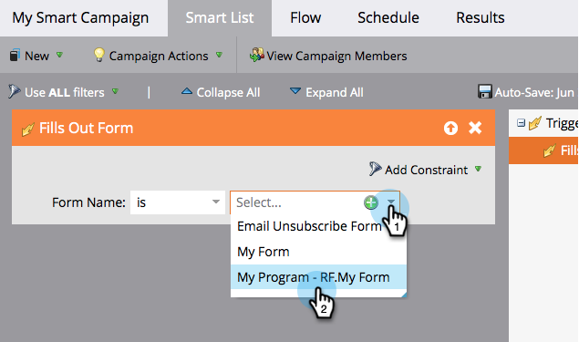

# Definire un elenco avanzato per Smart Campaign | Trigger {#define-smart-list-for-smart-campaign-trigger}

Esegui una campagna avanzata su una persona alla volta in base agli eventi live aggiungendo trigger.

1. Nella tua Smart Campaign, fai clic sul pulsante **Elenco avanzato** scheda .

   

1. Cerca il trigger desiderato e trascinalo nell’area di lavoro.

   

   >[!NOTE]
   >
   >Viene eseguita una campagna avanzata con i trigger **Trigger** modalità. Viene eseguito su una persona alla volta in base agli eventi attivati ed eventuali filtri aggiuntivi.

   >[!IMPORTANT]
   >
   >Quando utilizzi un campo booleano in un elenco smart della campagna di attivazione, devi impostarlo esplicitamente su &quot;false&quot; affinché il campo possa essere valutato correttamente durante l’esecuzione della campagna.

1. Fai clic sull’elenco a discesa e scegli un operatore .

   

   >[!CAUTION]
   >
   >Le linee rosse strizzate indicano errori o informazioni mancanti. Se non viene corretta, la campagna non sarà valida e non verrà eseguita.

   >[!TIP]
   >
   >In una Smart Campaign con trigger e filtri, i trigger si trovano nella parte superiore e, quando vengono attivati, solo le persone che soddisfano i criteri di filtro passano attraverso il flusso.

1. Definisci il trigger.

   

   >[!NOTE]
   >
   >Con più attivatori, una persona attraversa il flusso se **QUALSIASI** uno dei trigger viene attivato.

Per eseguire la campagna su un insieme di persone tutte contemporaneamente, scopri come [Definire un elenco avanzato per Smart Campaign | Batch](/help/marketo/product-docs/core-marketo-concepts/smart-campaigns/creating-a-smart-campaign/define-smart-list-for-smart-campaign-batch.md).

>[!MORELIKETHIS]
>
>[Aggiungere un passaggio di flusso a una campagna avanzata](/help/marketo/product-docs/core-marketo-concepts/smart-campaigns/flow-actions/add-a-flow-step-to-a-smart-campaign.md)
