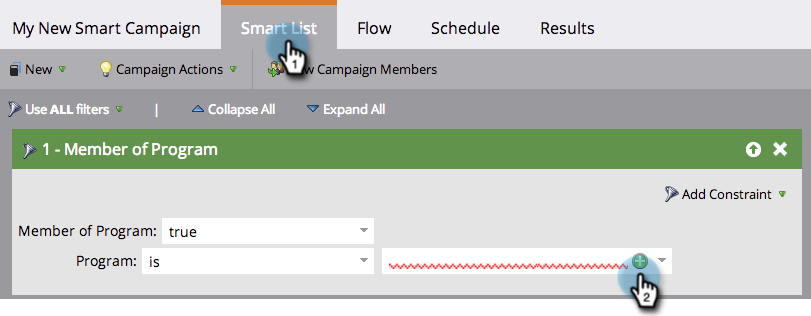
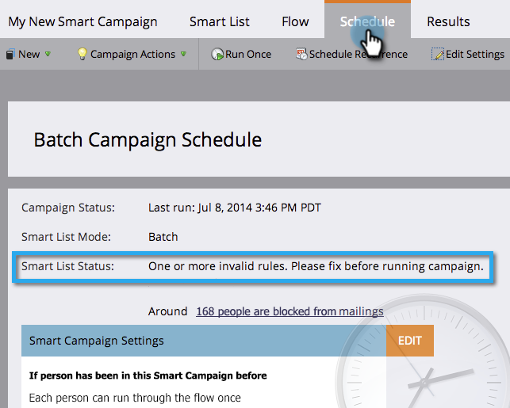

# Elenco di controllo per Smart Campaign {#smart-campaign-checklist}

Segui i passaggi riportati di seguito per garantire il corretto svolgimento della campagna avanzata ed evitare errori il più possibile.

## Eliminare gli errori degli elenchi avanzati {#get-rid-of-smart-list-errors}

Nella campagna intelligente, fai clic su **Elenco avanzato**. Sbarazzarsi di qualsiasi linea rossa stridente che si vede riparando gli errori.

>[!TIP]
>
>Le linee rosse strizzate indicano errori o informazioni mancanti. Se non viene corretta, la campagna non sarà valida e non verrà eseguita.
>
>Inoltre, **mantenere le cose semplici**. Se hai decine o centinaia di filtri, è difficile mantenerli e tenerne traccia. Il caricamento è inoltre più rapido per un numero inferiore di filtri.

>[!NOTE]
>
>Utilizzo **Membro dell’elenco avanzato** potrebbero avere errori in quell&#39;altro elenco. Controllate anche lì.

## Eliminare gli errori di flusso {#get-rid-of-flow-errors}

Nella campagna intelligente, fai clic su **Flusso**. Sbarazzarsi di qualsiasi linea rossa strizzata che vedi riparando gli errori.

>[!TIP]
>
>Passa il puntatore del mouse sopra la linea rossa ondulata per vedere i dettagli dell&#39;errore.

## Revisione della scheda Pianificazione {#review-the-schedule-tab}

In **Pianificazione** scheda, controllo **Smart** **Elenco** **Stato** per eventuali errori nella campagna intelligente che devono essere risolti.

## Limite limitazioni persona controllo {#check-person-restrictions-limit}

In **Pianificazione** , assicurati che il numero di persone qualificate non superi il limite di restrizione della persona.

>[!TIP]
>
>Se necessario, puoi  [ignorare le restrizioni relative alle persone in una campagna intelligente](/help/marketo/product-docs/core-marketo-concepts/smart-campaigns/using-smart-campaigns/override-person-restrictions-in-a-smart-campaign.md).

>[!NOTE]
>
>**Promemoria**
>
>Se la campagna intelligente continua a non riuscire, scopri come [comprendere le notifiche](/help/marketo/product-docs/core-marketo-concepts/miscellaneous/understanding-notifications.md) per capire cosa è andato storto e come ripararlo.

Ottimo lavoro! Mantieni questa lista di controllo a portata di mano prima di eseguire una campagna intelligente.
