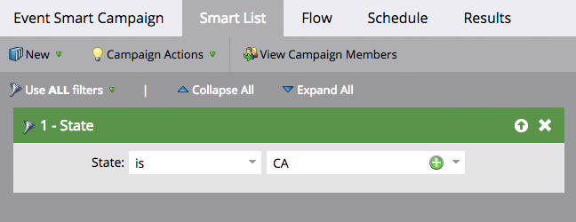

# Informazioni sulle campagne avanzate batch e trigger {#understanding-batch-and-trigger-smart-campaigns}

Esistono due tipi di campagne intelligenti: Batch e Trigger.

## Campagna batch {#batch-campaign}

>[!NOTE]
>
>**Definizione**
>
>Una campagna batch viene avviata in un momento specifico e interessa un gruppo specifico di persone tutte contemporaneamente. Un esempio potrebbe essere l&#39;invio di un&#39;e-mail a tutte le persone in California.

Le campagne batch avranno solo filtri all’interno della sezione dell’elenco avanzato (ovvero, nessun trigger).

Facendo clic su **Pianificazione** confermerà che Smart Campaign è impostato su &quot;Batch&quot;.

**Campagne avanzate in batch**

* Può essere programmato per le ricorrenze, ad esempio giornaliere, settimanali e mensili. È inoltre possibile eseguirli una sola volta.
* Sono visibili sul [visualizzazione pianificazione programmi](/help/marketo/product-docs/core-marketo-concepts/programs/program-schedule-view/navigating-the-program-schedule-view.md). Qualsiasi elemento che risulti dopo un passaggio &quot;Attendi&quot; all’interno di Smart Campaign non verrà incluso nella visualizzazione.

  

## Attiva campagna {#trigger-campaign}

>[!NOTE]
>
>**Definizione**
>
>Una campagna Trigger influisce su una persona alla volta in base a un evento attivato. Ad esempio, un trigger potrebbe fare clic su un collegamento in un messaggio e-mail.

Se una campagna avanzata utilizza almeno un trigger nella sezione Elenco avanzato, la modalità viene impostata automaticamente su Attivato.

Facendo clic su **Pianificazione** confermerà che Smart Campaign è impostato su &quot;Triggered&quot; (Attivato).

**Attivare campagne**

* Impossibile pianificare le ricorrenze. Possono essere impostate solo su attive o inattive.
* È possibile impostare più attivatori. Tuttavia, se viene attivato un trigger, verranno eseguite le azioni della campagna.

>[!TIP]
>
>Utilizza il [registro attività](/help/marketo/product-docs/core-marketo-concepts/smart-lists-and-static-lists/managing-people-in-smart-lists/locate-the-activity-log-for-a-person.md) per vedere cosa è successo passo dopo passo all’interno delle campagne avanzate. Puoi trovare il registro attività nell’ultima scheda della pagina dei dettagli di una persona.
