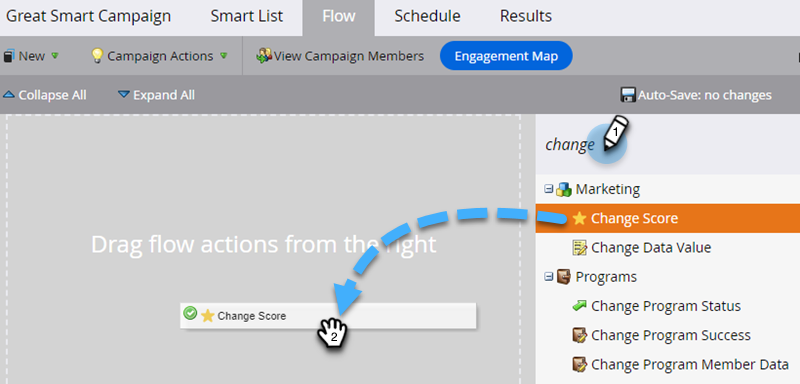

# Aggiungere un passaggio di flusso a una campagna avanzata {#add-a-flow-step-to-a-smart-campaign}

I passaggi di flusso indicano a Marketo Engage cosa desideri che accada a un gruppo di persone qualificate.

1. Vai a **[!UICONTROL Marketing Activities]**.

   

1. Seleziona la tua campagna avanzata e fai clic su **[!UICONTROL Flow]**.

   

1. Digita per cercare un passaggio di flusso, quindi trascinalo e rilascialo nell’area di lavoro. Puoi aggiungere più passaggi di flusso, ripetili con ogni passaggio che desideri eseguire nella campagna.

   

1. Fai clic sull’opzione e sul valore desiderati.

   

>[!NOTE]
>
>I passaggi di flusso vengono eseguiti nell’ordine in cui sono elencati. [Riordina i passaggi del flusso](/help/marketo/product-docs/core-marketo-concepts/smart-campaigns/flow-actions/reorder-the-flow-steps-in-a-smart-campaign.md){target="_blank"} per assicurarti che siano nella sequenza corretta.

>[!TIP]
>
>In caso di voce non valida, viene visualizzata una linea ondulata rossa. Passa il cursore del mouse sulla riga per vedere come correggerla.

Fantastico! Assicurati di [rivedere e convalidare Smart Campaign](/help/marketo/product-docs/core-marketo-concepts/smart-campaigns/creating-a-smart-campaign/smart-campaign-checklist.md){target="_blank"} prima di pianificarla o attivarla.

>[!MORELIKETHIS]
>
>* [Utilizzare Aggiungi scelta in un passaggio del flusso](/help/marketo/product-docs/core-marketo-concepts/smart-campaigns/flow-actions/use-add-choice-in-a-flow-step.md){target="_blank"}
>* [Riordinare i passaggi del flusso in una campagna avanzata](/help/marketo/product-docs/core-marketo-concepts/smart-campaigns/flow-actions/reorder-the-flow-steps-in-a-smart-campaign.md){target="_blank"}
