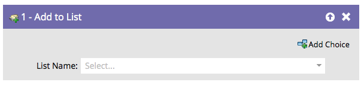

# Aggiungi all’elenco {#add-to-list}

Questo passaggio di flusso viene utilizzato per aggiungere persone agli elenchi.

Individuare e selezionare l&#39;elenco a cui si desidera aggiungere le persone.

