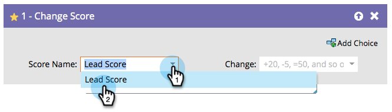

# Cambia punteggio {#change-score}

## Panoramica {#overview}

Puntare le persone è facile e potente per aiutare il tuo team di vendita a dare la priorità.

## Utilizzo {#usage}

1. Selezionare il campo punteggio che si desidera modificare.

   

   >[!TIP]
   >
   >Puoi creare più campi punteggio. Vedi [Creare un campo personalizzato in Marketo](/help/marketo/product-docs/administration/field-management/create-a-custom-field-in-marketo.md) per i dettagli.

1. Inserisci la modifica del punteggio desiderata.

   

   Modifiche:

   * **+5** per incrementare
   * **-5** decremento (numeri negativi consentiti)
   * **=5** farà il punteggio che il numero esatto
   * **=-5** farà il punteggio che numero esatto negativo

Ottieni rapidamente alcuni punteggi di base e poi modificali i risultati nel tempo. È quello che abbiamo fatto!
