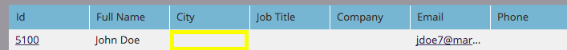

# Cancellare valori campo {#clear-field-values}

[Cambia valore dati](/help/marketo/product-docs/core-marketo-concepts/smart-campaigns/flow-actions/change-data-value.md) è ottimo, ma come _rimuovi_ completamente il valore? Buona domanda!

1. Nel passaggio del flusso, scegli il campo da cancellare e digita **[!UICONTROL NULL]** (tutte maiuscole) come **[!UICONTROL New Value]**.

   

1. Al termine del passaggio del flusso, il valore del campo scelto viene cancellato.

   

   >[!CAUTION]
   >
   >Se si lascia vuoto il nuovo valore o si immette semplicemente uno SPAZIO, il campo non verrà effettivamente vuoto. È necessario digitare NULL. Inoltre, ricorda che i passaggi di flusso non possono essere annullati dopo l’esecuzione.
