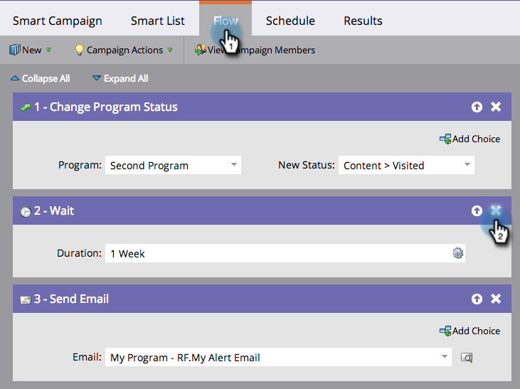

# Eliminare un passaggio di flusso {#delete-a-flow-step}

>[!CAUTION]
>
>Rimozione delle fasi del flusso, _soprattutto passaggi di attesa_ da campagne intelligenti attive, può avere risultati imprevisti. **Leggi questo articolo con attenzione.**

Prima di tutto, le basi. Ecco come rimuovere un passaggio di flusso indesiderato da una campagna intelligente. 1. Nel flusso di Smart Campaign, fai clic sull’icona X per eliminare qualsiasi passaggio di flusso.

1. Clic **Elimina**.

   

   Semplice e facile, giusto? La maggior parte delle volte...

   >[!CAUTION]
   >
   >Eliminazione, aggiunta e spostamento di passaggi all’interno di un **attivo** Campaign può sicuramente produrre risultati imprevisti. Prendi in considerazione la creazione di una nuova campagna, il test e quindi il passaggio a un’altra.

   Possono essere apportate modifiche a una campagna attiva, ma possono avere conseguenze impreviste. Ecco i dettagli:

   **Campagne avanzate in batch**

   Se la campagna:

   1. **Non corse mai.** Apportare tutte le modifiche desiderate. Non toccherà a nessuno finché non eseguirai quella campagna.
   1. **È una campagna intelligente ricorrente.** Le modifiche avranno effetto sulle persone nelle esecuzioni future, non sulle esecuzioni precedenti.
   1. **Già eseguito SENZA passaggi di attesa.** Nessuna persona sarà interessata perché la campagna è inattiva dopo l’esecuzione.
   1. **Sta correndo in questo momento.** Le modifiche possono causare un comportamento imprevisto a seconda della tempistica e dei dettagli dell’eliminazione. È consigliabile NON modificare una campagna batch in esecuzione. Per i casi di emergenza, scopri come [interrompere una campagna avanzata in esecuzione](/help/marketo/product-docs/core-marketo-concepts/smart-campaigns/using-smart-campaigns/abort-a-smart-campaign.md).

   1. **Già eseguito CON passaggi di attesa.** Molti dettagli su questo.\
      Quando una persona entra in un passaggio di attesa, la persona riduce la durata e il PASSAGGIO NUMERO a cui tornare. Vedi l’esempio seguente.

   **Attivare campagne avanzate**

   1. **Nessun passaggio di attesa.** Se elimini un passaggio normale, saranno interessate solo le persone che eseguiranno la campagna in futuro.
   1. **Con passaggi di attesa.** Vedi l’esempio seguente per le campagne batch. Si applica la stessa logica.

   >[!NOTE]
   >
   >**Esempio**
   >
   >1. Una campagna intelligente prevede 3 passaggi.
   >    * PASSAGGIO 1: Invia e-mail #1
   >    * PASSAGGIO 2: Attendi 1 settimana
   >    * PASSAGGIO 3: Invia e-mail #2
   >
   >1. Persone che hanno colpito **Passaggio 2** aspetterà 1 settimana prima di passare a **Passaggio 3**.
   >1. Eliminazione **Passaggio 2** durante la settimana.
   >1. Le persone continueranno ad aspettare per 1 settimana. (Non tornano automaticamente al flusso).
   >1. Quando finalmente torneranno, proveranno ad andare a **Passaggio 3**. Non la troveranno.
   >1. **IMPORTANTE:** Poiché ora sono disponibili solo 2 passaggi, *le persone non riceveranno #2. e-mail*

Apportare modifiche a una campagna attiva

Scopri questa funzione e acquisirai dimestichezza con le campagne intelligenti.
