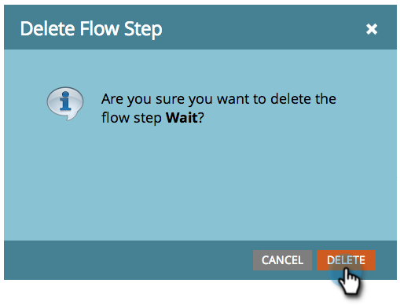

# Eliminare un passaggio di flusso {#delete-a-flow-step}

>[!CAUTION]
>
>La rimozione dei passaggi del flusso, _in particolare dei passaggi di attesa_ da campagne Smart attive, può produrre risultati imprevisti. Leggi questo articolo con attenzione.

Per prima cosa, analizziamo le nozioni di base. Ecco come rimuovere un passaggio di flusso indesiderato da una campagna avanzata.

1. In Smart Campaign **[!UICONTROL Flusso]**, fai clic sull&#39;icona **X** per eliminare qualsiasi passaggio di flusso.

   

1. Fare clic su **[!UICONTROL Elimina]**.

   

   >[!CAUTION]
   >
   >L&#39;eliminazione, l&#39;aggiunta e lo spostamento di passaggi all&#39;interno di una campagna _attiva_ può sicuramente produrre risultati imprevisti. Prendi in considerazione la creazione di una nuova campagna, il test e quindi il passaggio a un’altra.

   Possono essere apportate modifiche a una campagna attiva, ma possono avere conseguenze impreviste. Ecco i dettagli:

   **Campagne Smart In Batch**

   Se la campagna:

   1. **Mai eseguito**. Apportare tutte le modifiche desiderate. Non toccherà a nessuno finché non eseguirai quella campagna.
   1. **È una campagna Smart ricorrente**. Le modifiche avranno effetto sulle persone nelle esecuzioni future, non sulle esecuzioni precedenti.
   1. **Sono già stati eseguiti i passaggi SENZA attendere**.L&#39;operazione non verrà eseguita perché la campagna è inattiva dopo l&#39;esecuzione.
   1. **È in esecuzione**. Le modifiche possono causare un comportamento imprevisto a seconda della tempistica e dei dettagli dell’eliminazione. È consigliabile NON modificare una campagna batch in esecuzione. Per i casi di emergenza, scopri come [interrompere una campagna avanzata in esecuzione](/help/marketo/product-docs/core-marketo-concepts/smart-campaigns/using-smart-campaigns/abort-a-smart-campaign.md){target="_blank"}.

   1. **Già eseguito con passaggi di attesa.** Diversi dettagli su questo.\
      Quando una persona entra in un passaggio di attesa, la persona riduce la durata e il PASSAGGIO NUMERO a cui tornare. Vedi l’esempio seguente.

   **Attiva campagne intelligenti**

   1. **Nessun passaggio di attesa**. Se elimini un passaggio normale, saranno interessate solo le persone che eseguiranno la campagna in futuro.
   1. **Con passaggi di attesa**. Vedi l’esempio seguente per le campagne batch. Si applica la stessa logica.

   >[!NOTE]
   >
   >**Esempio**
   >
   >1. Una campagna intelligente prevede 3 passaggi.
   >    * PASSAGGIO 1: Invia e-mail #1
   >    * PASSAGGIO 2: Attendi 1 settimana
   >    * PASSAGGIO 3: Invia e-mail #2
   >
   >1. Le persone che hanno raggiunto il **passaggio 2** attenderanno 1 settimana prima di passare al **passaggio 3**.
   >1. Eliminare **Passaggio 2** durante la settimana.
   >1. Le persone continueranno ad attendere per 1 settimana (non torneranno automaticamente al flusso).
   >1. Quando torneranno, tenteranno di passare al **passaggio 3**. Non la troveranno.
   >1. **IMPORTANTE:** Poiché sono disponibili solo 2 passaggi, le persone _non riceveranno l&#39;e-mail #2_.
