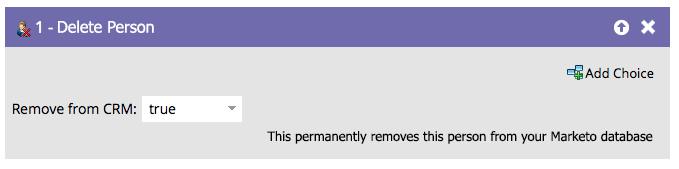

# Elimina persona {#delete-person}

Talvolta le persone sbagliate vengono inserite nel tuo database. Il passaggio di flusso Elimina persona può eliminarli.

>[!CAUTION]
>
>Quando elimini una persona, verranno eliminati anche tutti i dati RCE storici. Non può essere annullata.

1. Quando trascini nel passaggio del flusso, questo verrà automaticamente impostato per l’eliminazione anche dal CRM.

   

1. Puoi eliminare dal Marketo Engage e non dal CRM, come segue:

   

>[!NOTE]
>
>La rimozione della persona dal CRM _funziona solo con[!DNL Salesforce]_. Se si elimina una persona da Marketo e si sceglie di mantenerla in [!DNL Salesforce], questa verrà ricreata in Marketo se il record [!DNL Salesforce] verrà aggiornato.
