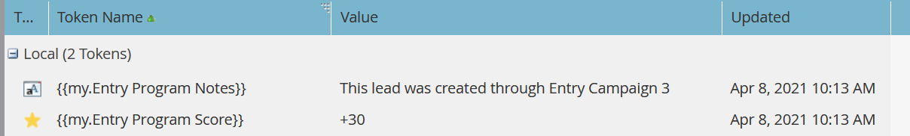

# Esegui campagna {#execute-campaign}

Una campagna eseguibile, come altre campagne, contiene un elenco avanzato, un flusso e una pianificazione. A differenza di altre campagne, in realtà non è possibile pianificarle o attivarle. Può essere chiamato solo da un’altra campagna tramite il passaggio Esegui flusso campagna . I passaggi del flusso nella Campagna eseguibile vengono eseguiti in serie con la campagna principale (a differenza di Request Campaign, che viene eseguita in parallelo in una campagna trigger separata).

>[!NOTE]
>
>Le campagne eseguibili sono sempre figlie della campagna (padre) che le chiama.

## Quando utilizzare Esegui campagna {#when-to-use-execute-campaign}

Puoi eseguire molte operazioni con una campagna eseguibile. Sono progettati per facilitare attività operative comuni, come l’indirizzamento dei lead, la gestione del ciclo di vita e il punteggio (tra gli altri), e possono essere utilizzati per eseguire lo stesso flusso di lavoro dall’interno di Campagne in batch o con trigger.

È inoltre possibile utilizzarli quando è necessario eseguire un flusso separato, ma è necessario dipendere dai risultati di tale flusso nelle scelte successive delle fasi di flusso (ovvero, se necessario, eseguire questa operazione).

Esegui campagna è un miglioramento rispetto a [Richiedi campagna](/help/marketo/product-docs/core-marketo-concepts/smart-campaigns/flow-actions/request-campaign.md), in quanto può essere eseguita in serie o in parallelo, mentre quest&#39;ultima viene eseguita solo in parallelo.

>[!NOTE]
>
>I passi di attesa e i hook web non saranno mai compatibili con le campagne eseguibili. Per questi casi, dovrai utilizzare invece Richiedi campagna .

## Come creare una campagna eseguibile {#how-to-create-an-executable-campaign}

1. Fai clic con il pulsante destro del mouse sul programma desiderato e seleziona **Nuova campagna avanzata**.

   

1. Assegna un nome, seleziona la casella di controllo **Eseguibile** e fai clic su **Crea**.

   

1. Definisci l’elenco e il flusso avanzati, come qualsiasi altra campagna avanzata.

Puoi anche clonare una campagna avanzata esistente. Se cloni una Campagna Eseguibile esistente, dovrai comunque selezionare la casella di controllo **Eseguibile** dopo averla nominata.

>[!NOTE]
>
>Non puoi clonare una campagna che contiene trigger.

## Usa contesto token campagna padre {#use-parent-campaign-token-context}

Se è impostato su true, i seguenti contesti di token verranno inviati alla campagna figlio (quella in corso di esecuzione):

* Token personali
* Token di campagna
* Token del programma
* Token membri
* [Token di attivazione](/help/marketo/product-docs/marketo-sales-insight/msi-for-salesforce/features/tabs-in-the-msi-panel/interesting-moments/trigger-tokens-for-interesting-moments.md)  (se chiamati da una campagna attivata)

**Interazione API**

Quando utilizzi la campagna di pianificazione o richiesta [nell&#39;API](https://developers.marketo.com/rest-api/assets/smart-campaigns/#batch), puoi entrambi trasmettere i valori per I miei token, che sostituiscono i valori impostati per tali token nella campagna che stai chiamando. Se la campagna esegue un’altra campagna e imposta &quot;Use Parent Context to True&quot;, utilizzerà i valori passati tramite l’API anziché i valori impostati nell’applicazione.

## Aspetti da considerare {#things-to-note}

* L&#39;Elenco avanzato escluderà chiunque non si qualifichi. Se una persona si qualifica, il record di attività della campagna eseguita risultante li elencherà come &quot;Qualificato: TRUE&quot; (e FALSE in caso contrario)
* Si applicano le regole di qualificazione della campagna (Impostazioni di Smart Campaign nella scheda Pianificazione )
* Le campagne eseguibili non possono essere richiamate in più aree di lavoro
* Se utilizzi l&#39;azione di flusso [Rimuovi da flusso](/help/marketo/product-docs/core-marketo-concepts/smart-campaigns/flow-actions/remove-from-flow.md) per il targeting di una campagna eseguibile, eseguirai il targeting sia per il figlio che per il padre
* Sfruttando l’ereditarietà dei token - Ad esempio, se disponi di un singolo flusso di punteggio comune attivato da più risorse diverse, puoi definire un punteggio My Token predefinito nella campagna figlio e nella campagna padre in modo da poter sovrascrivere il valore della campagna Punteggio figlio per le campagne principali (vedi sotto per un esempio visivo)
* Al momento la nidificazione delle campagne eseguibili non è disponibile, ma sarà in una prossima versione

>[!CAUTION]
>
>Non lasciare mai non validi gli elenchi smart per le campagne eseguibili, altrimenti **nessuno** potrà qualificarli. Si consiglia di creare risorse separate per gli elenchi avanzati, definirle completamente e assicurarsi che siano valide. Quindi, utilizza il filtro &quot;Membro di Smart List&quot; nella Campagna eseguibile in modo da poter cambiare la definizione della tua smart list.

## Esempio di ereditarietà dei token {#token-inheritance-example}

Di seguito è riportato un esempio visivo di Ereditarietà token in una campagna eseguibile e due campagne principali: uno con contesto token impostato su **True**, l&#39;altro su **False**.

Campagna per bambini con punteggio di cambiamento token.

La campagna per bambini è My Tokens.

**Esempio 1 - True**

Nel passaggio del flusso di Esegui campagna della prima campagna padre, l’opzione &quot;Usa contesto token campagna padre&quot; è impostata su **True**.

La campagna principale è My Tokens.

I risultati: punteggio modificato di +10.

**Esempio 2: False**

Nel filtro Esegui campagna della seconda campagna padre, &quot;Usa contesto token campagna padre&quot; è impostato su **False**.

La campagna principale è My Tokens.

I risultati: punteggio immutato, perché è stato utilizzato il valore di punteggio della campagna figlio, +0.

