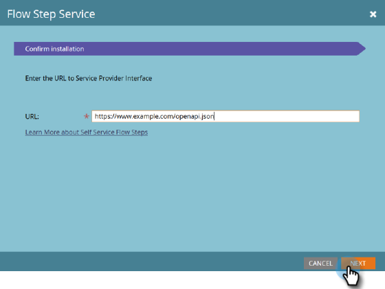

# Servizio a gradini di flusso {#flow-step-service}

I passaggi di flusso self-service è un framework e un insieme di funzioni per l’authoring, la pubblicazione e l’integrazione di servizi web nelle campagne avanzate Adobe Marketo Engage. Questa guida è destinata agli utenti finali del Marketo Engage che desiderano installare e utilizzare servizi già creati e pubblicati. Per informazioni sull&#39;authoring e la pubblicazione del tuo servizio, consulta [Archivio GitHub per l’interfaccia dei provider di servizi](https://github.com/adobe/Marketo-SSFS-Service-Provider-Interface){target="_blank"}. A Proof-of-Concept Lookup Table implementation may be found [here](https://github.com/adobe/mkto-flow-lookup){target="_blank"}.

## Onboarding e gestione dei servizi {#onboarding-and-managing-services}

L&#39;installazione di un passaggio di flusso personalizzato richiede le autorizzazioni di amministratore in Marketo (**Gestire i webhook** nella versione del 21 gennaio, Modifica nella versione dell’11 marzo). Oltre all&#39;URL di installazione, tutti gli altri aspetti di un servizio in esecuzione possono essere modificati dopo il completamento dell&#39;onboarding iniziale, estraendo i dettagli del servizio dalla griglia Fornitori di servizi.

## URL di installazione {#installation-url}

Per iniziare l’installazione, devi prima ottenere l’URL del documento OpenAPI che definisce il servizio. Il provider di servizi dovrebbe essere in grado di fornirti questo servizio e in genere avrà un URL che termina con `/openapi.json`. Gli URL completi avranno un aspetto simile a `https://www.example.com/OpenAPI.json`. Una volta ottenuto questo URL, vai al menu Fornitori di servizi nella tua sezione Amministratore.

Fai clic su **Successivo** per passare alla sezione Inserisci credenziali del servizio.

## Immettere le credenziali del servizio {#enter-service-credentials}

Per accedere al servizio installato, Marketo deve disporre di credenziali API valide. Queste credenziali devono essere fornite dal provider di servizi. I servizi dispongono di tre diverse opzioni di autenticazione, pertanto potresti visualizzare uno dei tre diversi prompt per le credenziali: **Chiave API** che dispone di un solo campo di ingresso, **Autenticazione di base** che richiede un nome utente e una password e può anche richiedere un campo chiamato Realm, e **OAuth2** utilizzando _Credenziali client_ una sovvenzione, che richiede un _ID client_ e _Segreto client_.

Quando salvi le credenziali, Marketo tenterà di chiamare l’endpoint di stato del servizio per verificarne la validità. Se le credenziali fornite non sono valide, verrà visualizzato un errore che lo indica.

## Guida all’onboarding (opzionale) {#onboarding-guide}

Alcuni provider di servizi includeranno una fase opzionale della Guida all’onboarding. Questo passaggio include tutte le istruzioni aggiuntive per completare l’onboarding del servizio specifiche per quel servizio.

## Mappatura dei campi {#field-mapping}

Per ricevere o restituire dati da un campo lead specifico, è necessario mappare tale campo. Anche se la mappatura è un passaggio obbligatorio durante l’onboarding, puoi sempre tornare a modificare le mappature in un secondo momento. Esistono due tipi di mappature configurate in schermate separate: **Campi in uscita**, che vengono inviati al servizio quando Marketo richiama il passaggio del flusso, e **Campi in entrata** che sono campi che possono ricevere dati dal servizio quando restituisce dati a Marketo.

>[!NOTE]
>
>Mappando un campo in uscita, si concede a Marketo l’autorizzazione a trasmettere i dati da quel campo relativi ai lead elaborati dal servizio associato. Assicurati di disporre di una capacità giuridica e di un&#39;autorità adeguate per trasmettere questi dati al tuo fornitore di servizi, in quanto questi campi possono includere informazioni personali coperte dalle leggi sulla privacy, la protezione e la posizione dei dati.

Le mappature dei campi opzionali possono essere disattivate senza interruzioni del servizio, ma le mappature richieste potrebbero non essere rimosse o disattivate completamente.

## Mappature basate su servizi {#service-driven-mappings}

I servizi che dispongono di un set fisso di ingressi e uscite, come una fase del flusso di registrazione degli eventi, utilizzano **Mappature basate su servizi**. Per questo tipo di mappatura, il provider di servizi fornirà sia un tipo di dati che un suggerimento sotto forma di un nome API. Se l’hint corrisponde al nome API di un campo lead esistente, tale campo viene compilato automaticamente nella sezione di mappatura. Per i campi senza un suggerimento corrispondente, dovrai compilare manualmente la mappatura dall’elenco dei campi con il tipo di dati corrispondente. Le mappature richieste devono essere compilate per completare l’onboarding.

## Mappature guidate dall&#39;utente {#user-driven-mappings}

I servizi che non dispongono di un set fisso di input e output, come un servizio di formattazione delle date, utilizzano **Mappature guidate dall&#39;utente**. Ciò significa che ogni campo in entrata e in uscita deve essere configurato da un amministratore.

## Campi in uscita {#outgoing-fields}

I campi in uscita sono quelli inviati al servizio Passaggio flusso quando tale passaggio viene utilizzato in una campagna avanzata.

## Campi in entrata {#incoming-fields}

I campi in entrata sono quelli in cui il servizio Passaggio flusso può scrivere i dati.

## Opzioni di configurazione (facoltativo) {#configuration-options}

Alcuni servizi dispongono di opzioni di configurazione globale facoltative o richieste. Se sono necessarie opzioni, prima di salvare o completare l’onboarding è necessario impostare un valore per tutte le opzioni richieste. I parametri i cui nomi sono in corsivo vengono inviati al servizio richiamato come intestazioni.

## Ritiro di un servizio {#retiring-a-service}

Per facilitare le transizioni verso versioni nuove o alternative di un servizio, senza interrompere l’utilizzo attivo, i servizi possono essere ritirati dal menu Fornitori di servizi. **Ritiro di un servizio** rimuove il passaggio di flusso corrispondente dalla palette Flusso di Smart Campaign, in modo che non sia possibile crearne di nuovi. Nella maggior parte dei casi, è necessario disporre di un servizio sostitutivo pronto per sostituire quello esistente quando si sceglie di ritirare un servizio.

## Servizio obsoleto {#service-deprecation}

A volte i fornitori di servizi dovranno deprecare i servizi di flusso come parte normale del ciclo di vita del software. Quando un provider di servizi lo annuncia, la data e il messaggio di obsolescenza verranno compilati nella vista a griglia Fornitori di servizi . Se si continua a utilizzare un servizio che è stato dichiarato obsoleto, si potrebbero verificare interruzioni del servizio se non risponde più nel modo previsto o se si smette di accettare richieste da Marketo Smart Campaigns, pertanto è necessario prestare particolare attenzione alle notifiche di supporto obsolete ricevute e adottare le misure appropriate per rimuovere o sostituire eventuali passaggi dal servizio ancora in uso.

## Utilizzo di passaggi di flusso di terze parti e personalizzati {#using-third-party-and-custom-flow-steps}

Le fasi di flusso installate possono essere utilizzate in gran parte come le fasi di flusso standard. Tutti i parametri di flusso definiti dal servizio vengono presentati agli utenti finali.

## Aggiornamento delle liste di selezione {#refreshing-picklists}

Marketo aggiornerà le scelte della lista di selezione per i servizi ogni notte, ma a volte sarà necessario disporre di nuove scelte, ad esempio per la creazione di campagne. Puoi aggiornarli facilmente da qualsiasi istanza del tuo passaggio di flusso utilizzando il pulsante di aggiornamento oppure accedendo al menu Amministratore > Fornitori di servizi e facendo clic su Aggiorna elenco puntato dopo aver selezionato il servizio.

## Controllo dei campi in entrata {#checking-incoming-fields}

Per verificare quali campi in entrata sono configurati per un determinato passaggio di flusso, passa il cursore sull’icona della descrizione comando corrispondente. È utile per determinare quali campi possono cambiare quando un lead lo attraversa, in modo da poter configurare le scelte nei passaggi successivi utilizzando tali campi.

## Campi in entrata e modifiche al valore dei dati {#incoming-fields-and-data-value-changes}

A differenza della maggior parte degli altri passaggi di flusso, quelli implementati con il framework SSFS possono riscrivere i dati nei campi principali mappati da un amministratore e registrare tali modifiche come attività di modifica del valore dei dati.  Quando un passaggio di flusso scrive i dati in questo modo, tutte le modifiche verranno completate prima che la campagna avanzata passi a qualsiasi passaggio successivo, in modo che tutti i dati scritti possano essere utilizzati nelle scelte successive delle fasi di flusso.

## Registri e statistiche del servizio {#service-logs-and-statistics}

A ogni servizio Flow Step sono associati diversi tipi di log per monitorare lo stato di salute e risolvere eventuali problemi relativi all&#39;integrazione.

## Statistiche servizio {#service-statistics}

Il registro delle statistiche del servizio aggrega i risultati delle chiamate e dei callback per ogni servizio. Sono raggruppati per ora, livello (blocco o record) e codice e forniscono conteggi e il messaggio di log più recente per ciascun codice ricevuto. Questa dashboard è progettata principalmente per aiutare il monitoraggio della salute dei servizi.
