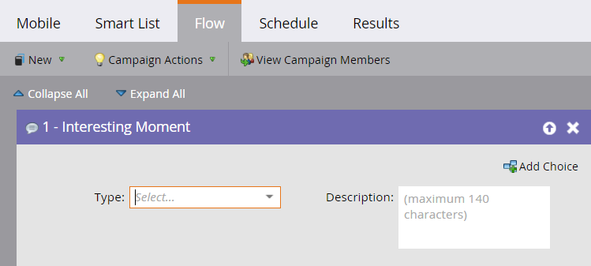

# Momento interessante {#interesting-moment}

Se hai Marketo Sales Insight, puoi utilizzare il passaggio di flusso **Momento di interesse** per dare visibilità al team di vendita alle cose interessanti che i tuoi dipendenti stanno facendo.

1. Selezionare il momento di interesse **[!UICONTROL type]** che si desidera utilizzare.

   

1. Crea un **[!UICONTROL description]** che spieghi il momento interessante al tuo team vendite.

   

   >[!TIP]
   >
   >_Meno è più_. Collabora con il tuo sales team per confermare che i momenti interessanti sono davvero interessanti.

Puoi anche utilizzare [token in momenti interessanti](/help/marketo/product-docs/marketo-sales-insight/msi-for-salesforce/features/tabs-in-the-msi-panel/interesting-moments/trigger-tokens-for-interesting-moments.md){target="_blank"} per creare descrizioni dinamiche molto utili.

>[!MORELIKETHIS]
>
>* [Utilizzo di momenti di interesse](/help/marketo/product-docs/marketo-sales-insight/msi-for-salesforce/features/tabs-in-the-msi-panel/interesting-moments/using-interesting-moments.md){target="_blank"}
>* [Token per i momenti di interesse](/help/marketo/product-docs/marketo-sales-insight/msi-for-salesforce/features/tabs-in-the-msi-panel/interesting-moments/trigger-tokens-for-interesting-moments.md){target="_blank"}
