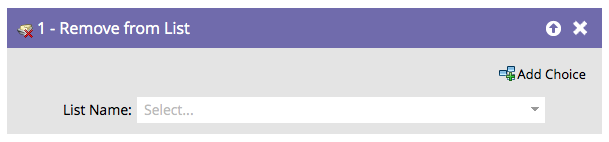
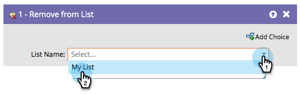

# Rimuovi dall’elenco {#remove-from-list}

Poiché è possibile [aggiungerlo all&#39;elenco](/help/marketo/product-docs/core-marketo-concepts/smart-campaigns/flow-actions/add-to-list.md){target="_blank"}, è inoltre necessario un metodo per rimuovere le persone dagli elenchi.

1. Individuare e selezionare l&#39;elenco da cui si desidera rimuovere le persone.

   

Tutto qui!
