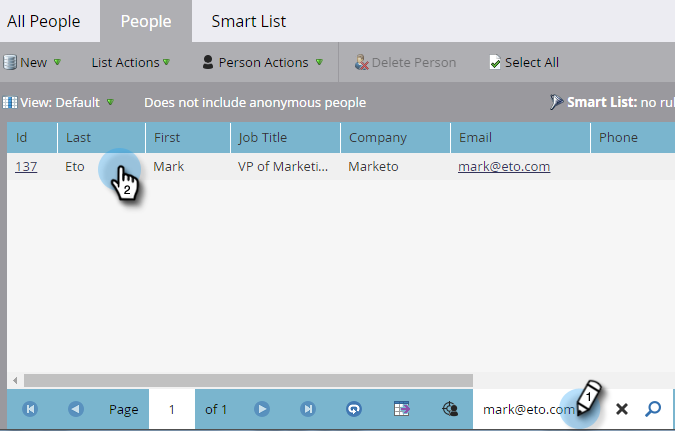

# Richiedere campagna {#request-campaign}

È possibile inserire persone in una campagna specifica utilizzando il passaggio di flusso singolo &quot;[!UICONTROL Request Campaign]&quot;.

>[!NOTE]
>
>La campagna in cui stai inserendo la persona deve essere attiva e richiedere il trigger [Campaign is Requested](/help/marketo/product-docs/core-marketo-concepts/smart-campaigns/using-smart-campaigns/setting-up-a-trigger-smart-campaign-for-sales-using-campaign-is-requested.md){target="_blank"}.

1. In **[!UICONTROL Database]**, trovare e selezionare la persona o le persone desiderate.

   

1. Fai clic su **[!UICONTROL Person Actions]**, passa il puntatore su **[!UICONTROL Special]** e seleziona **[!UICONTROL Request Campaign]**.

   

1. Selezionare la campagna in cui si desidera inserire la persona e fare clic su **[!UICONTROL Run Now]**.

   

1. In alto a destra nella schermata, vedrai quando è fatto. Fai clic su **[!UICONTROL View Results]**.

   

   La tua persona è ora nella campagna richiesta.

   

>[!TIP]
>
>Utilizzare il trigger o il filtro &quot;[!UICONTROL Campaign is Requested]&quot; per trovare le persone interessate da questo passaggio di flusso.
