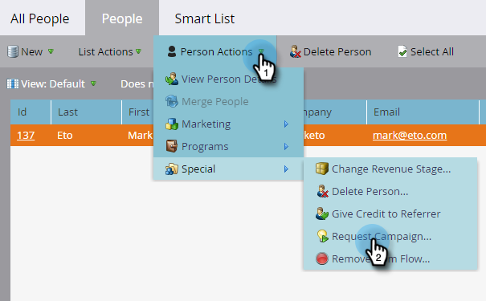

# Richiedi campagna {#request-campaign}

Puoi inserire persone in una campagna specifica utilizzando il passaggio di flusso singolo &quot;[!UICONTROL Richiedi campagna]&quot;.

>[!NOTE]
>
>La campagna in cui stai inserendo la persona deve essere attiva e richiedere il trigger [Campaign is Requested](/help/marketo/product-docs/core-marketo-concepts/smart-campaigns/using-smart-campaigns/setting-up-a-trigger-smart-campaign-for-sales-using-campaign-is-requested.md){target="_blank"}.

1. Nel **[!UICONTROL Database]**, trovare e selezionare la persona o le persone desiderate.

   

1. Fai clic su **[!UICONTROL Azioni persona]**, passa il puntatore del mouse su **[!UICONTROL Speciale]** e seleziona **[!UICONTROL Richiedi campagna]**.

   

1. Selezionare la campagna in cui si desidera inserire la persona e fare clic su **[!UICONTROL Esegui ora]**.

   

1. In alto a destra, vedrai quando è fatto. Fare clic su **[!UICONTROL Visualizza risultati]**.

   

   La tua persona è ora nella campagna richiesta.

   

   Ottimo lavoro!

>[!TIP]
>
>Utilizza il trigger o il filtro &quot;[!UICONTROL Campaign is Requested]&quot; per trovare le persone interessate da questo passaggio di flusso.
