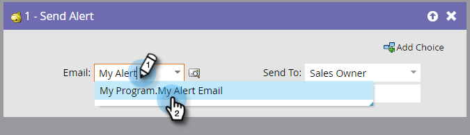

# Invia avviso {#send-alert}

## Panoramica {#overview}

Marketo può inviare un messaggio e-mail di notifica con le informazioni personali a chiunque: il proprietario, un partner o un altro utente. Utilizza il **Invia avviso** passaggio di flusso.

## Utilizzo {#usage}

1. Trova e seleziona l’e-mail che desideri inviare.

   

   >[!NOTE]
   >
   >L&#39;avviso e-mail deve contenere tutte le informazioni di intestazione ed essere in **Approvato** stato.

1. Puoi fare clic sull’icona di anteprima per assicurarti di aver selezionato l’e-mail corretta.

   

   >[!NOTE]
   >
   >Assicurati di utilizzare il **Invia informazioni avviso** token nell’e-mail.

1. Selezionare il destinatario dell&#39;avviso. È possibile scegliere Proprietario vendite o Proprietario conto.

   

1. Se necessario, aggiungi altri indirizzi e-mail, separati da virgola o punto e virgola.

   

   >[!TIP]
   >
   >Nelle campagne trigger puoi utilizzare i token in **Ad Altre E-Mail** come `{{lead.Territory Owner}}` o `{{my.Alert Recipient}}` purché i valori siano indirizzi e-mail validi. Token in **Ad Altre E-Mail** non funzionerà in una campagna batch.

Tutto qui! Ora sai come utilizzare il **Invia avviso** passaggio di flusso.

>[!MORELIKETHIS]
>
>[Creare un messaggio e-mail](/help/marketo/product-docs/email-marketing/general/creating-an-email/create-an-email.md)
