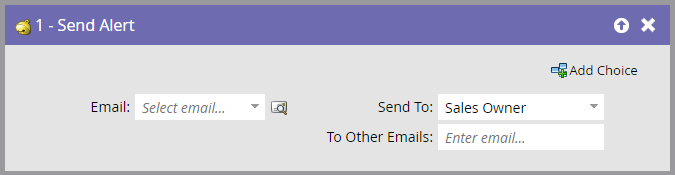
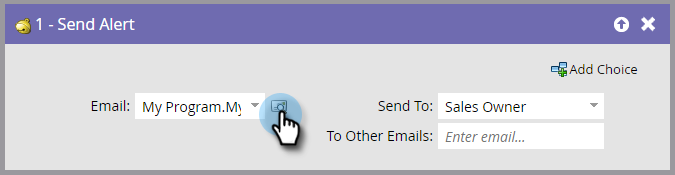
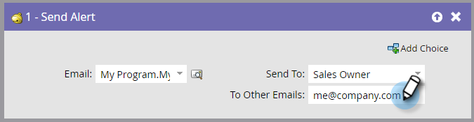

# Invia avviso {#send-alert}

Marketo Engage può inviare un messaggio e-mail di notifica con le informazioni personali a chiunque: il proprietario, un partner o un altro utente. Utilizza il passaggio di flusso &quot;[!UICONTROL Send Alert]&quot;.

1. Trova e seleziona l’e-mail che desideri inviare.

   

   >[!NOTE]
   >
   >L&#39;avviso e-mail deve contenere tutte le informazioni di intestazione ed essere nello stato **[!UICONTROL Approved]**.

1. Puoi fare clic sull’icona di anteprima per assicurarti di aver selezionato l’e-mail corretta.

   

   >[!NOTE]
   >
   >Utilizza il token &quot;[!UICONTROL Send Alert Info]&quot; nel messaggio e-mail.

1. Selezionare il destinatario dell&#39;avviso. È possibile scegliere [!UICONTROL Sales Owner] o [!UICONTROL Account Owner].

   

1. Se necessario, aggiungi altri indirizzi e-mail, separati da virgola o punto e virgola.

   

   >[!TIP]
   >
   >Nelle campagne di attivazione è possibile utilizzare i token in **[!UICONTROL To Other Emails]**, ad esempio `{{lead.Territory Owner}}` o `{{my.Alert Recipient}}`, purché i valori siano indirizzi e-mail validi. I token in **[!UICONTROL To Other Emails]** non funzioneranno in una campagna batch.

>[!MORELIKETHIS]
>
>[Crea un&#39;e-mail](/help/marketo/product-docs/email-marketing/general/creating-an-email/create-an-email.md){target="_blank"}
