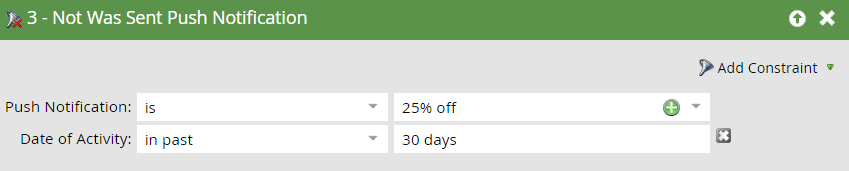

# Trigger e filtri per campagne avanzate mobili {#triggers-and-filters-for-mobile-smart-campaigns}

Puoi impostare attivatori e filtri per una campagna avanzata app mobile.

Per la maggior parte delle attività, sono disponibili un trigger, un filtro e un filtro di inattività. Utilizza i filtri di inattività per tracciare un’azione, ad esempio toccando una notifica push, che *non ha* generato.

* L&#39;App Mobile È/Era Installata
* App mobile aperta
* Con/Avevano Attività App Mobile
* Con/Avevano sessione app mobile
* Notifiche push per dispositivi mobili con tocco/tocco

Sono disponibili solo filtri per questa attività:

* È stata inviata una notifica push - filtro e filtro di inattività

Cerca **app mobile** nel pannello di destra per elencare tutti i trigger e i filtri dell’app mobile.

## Vincoli {#constraints}

Utilizza i vincoli con i trigger e i filtri per ordinare ulteriormente i dati.

Tutti i trigger e i filtri, a eccezione di Era stato inviato una notifica push, contengono i due vincoli standard seguenti:

* Tipo di dispositivo - iPod, iPhone, iPhone 6 Plus, iPad mini, iPad, smartphone Android, tablet Android, Sconosciuto (questo è un elenco predefinito)

* Piattaforma - iPhone o Android

Alcuni trigger e filtri offrono vincoli aggiuntivi, ad esempio:

* Versione app: modo per eseguire il targeting delle persone che non utilizzano la versione più recente. Ad esempio, se la versione più recente dell’app è 2.0, puoi usarla per trovare persone che NON sono nella versione 2.0 dell’app

* Install Source - Attualmente, l’unica opzione è API

* Impostazioni internazionali: l&#39;impostazione sul dispositivo

* App mobile: il nome dell&#39;app specifica. Utile per specificare se ne sono presenti più di uno

* Versione piattaforma - Versione del sistema operativo

* Durata sessione (secondi) - Ora della sessione in cui l’app è in primo piano

* È abilitato per push - **True** significa che è possibile inviare le notifiche push. **** Falsemeans che non possono; ad esempio, la persona potrebbe aver rinunciato alla ricezione di notifiche push

## Triggers e filtri {#triggers-and-filters}

**Con app mobile**

Usa questo filtro per scoprire tutte le persone che hanno mai avuto la tua app installata. Questa opzione è disponibile solo come filtro.

>[!NOTE]
>
>Il filtro trova le installazioni correnti e precedenti, in quanto Marketo non tiene traccia delle disinstallazioni dell’app.

**Vincoli**: Tipo di dispositivo, Piattaforma, App mobile, Versione app mobile, Tipo di dispositivo, Origine di installazione, È abilitato tramite push e Impostazioni internazionali

>[!TIP]
>
>È consigliabile specificare Has Mobile App = true e Is Push Enabled = true, nonché il nome dell’app mobile durante la definizione dell’elenco avanzato di chi deve ricevere una notifica push.

L&#39;App Mobile È/Era Installata

* App mobile installata - trigger

* App mobile installata - filtro

* NON è stata installata l&#39;app mobile - filtro di inattività

**Vincoli**: Tipo di dispositivo, piattaforma, versione app, lingua e origine di installazione

App mobile aperta

* App mobile aperta - trigger

* App mobile aperta - filtro

* L&#39;app NON mobile è stata aperta - filtro di inattività

**Vincoli**: Tipo di dispositivo e piattaforma

Con/Avevano Attività App Mobile

Queste forniscono un modo efficace per monitorare l’attività mobile personalizzata. Sarà necessario collaborare con lo sviluppatore per configurare il tracciamento [per Android](https://developers.marketo.com/documentation/mobile/installation-instructions-on-android) e [per iOS](https://developers.marketo.com/documentation/mobile/installation-instructions-on-ios).

* Con attività app mobile - trigger

* Avevo attività app mobile - filtro

* Attività app mobile non disponibile - filtro di inattività

**Vincoli**: Tipo di dispositivo e piattaforma, più cinque ulteriori:

* Azione: attività mobile personalizzata

* Tipo azione : campo di testo (facoltativo) utilizzato per categorizzare più azioni

* Dettagli azione - (facoltativo) Campo di testo che fornisce informazioni aggiuntive su un&#39;azione

* Metrica azione : campo numerico (facoltativo) che fornisce informazioni aggiuntive su un’azione (ad esempio, prezzo)

* Lunghezza azione (secondi) - (facoltativo) Campo numerico che può essere utilizzato per acquisire il tempo necessario a completare un&#39;azione da parte di un utente

I vincoli di azione ti consentono di utilizzare il trigger e i filtri per tenere traccia delle attività mobili in modo molto simile.

>[!NOTE]
>
>**Esempio**
>
>Sotto il tipo di azione *Shopping*, ecco un&#39;azione molto specifica, con gli altri vincoli che la definiscono:
>
>* Comprata una camicia
   >   * Era rosso
   >   * È costato 30$
   >   * Ci sono voluti 20 secondi per comprare

Ecco come si presenta il filtro in Marketo:

>[!NOTE]
>
>**Esempio**
>
>Puoi avere più azioni sotto lo stesso tipo di azione. Infatti, la vostra esperienza di shopping normale può coinvolgere diverse colonne sotto Shopping! Che ne dici di un po&#39; di calze da accompagnare?
>
>| Tipo di azione | Shopping | Shopping |
>|---|---|---|
>| Azione | Camicia comprata | Pantaloni comprati |
>| Dettagli azione | Colore | Colore |
>| Metrica azione | Prezzo | Prezzo |

**Con/Avevano sessione app mobile**

* Con sessione app mobile - trigger

* Sessione app mobile con filtro

* Sessione app mobile NOT - filtro di inattività

**Vincoli**: Tipo di dispositivo, piattaforma e lunghezza della sessione (secondi)

Notifiche push con tocco/a comparsa

* Tocca Notifica push - trigger

* Notifica push con patch - filtro

* Notifica push non con tocco - Filtro di inattività

**Vincoli**: Tipo di dispositivo, piattaforma, versione dell’app mobile, notifica push e versione della piattaforma

>[!TIP]
>
>Utilizza il filtro di inattività delle notifiche push non toccate per individuare le persone che non hanno toccato una notifica push inviata di recente, in modo da poter seguire tramite e-mail.

**È stata inviata una** notifica pushQuesta attività è disponibile solo come filtro.

* È stata inviata la notifica push - filtro

* NOTA INVIATA Notifica push - Filtro inattività

**Vincoli**: Notifiche push e app mobile

>[!MORELIKETHIS]
>
>* [Aggiungere un vincolo a un filtro elenco avanzato](/help/marketo/product-docs/core-marketo-concepts/smart-lists-and-static-lists/using-smart-lists/add-a-constraint-to-a-smart-list-filter.md)
>* [Utilizzare i filtri di inattività in un elenco avanzato](/help/marketo/product-docs/core-marketo-concepts/smart-lists-and-static-lists/using-smart-lists/use-inactivity-filters-in-a-smart-list.md)

