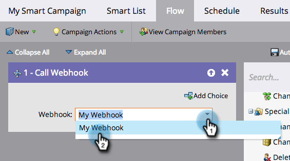

# Utilizzare un webhook in una campagna avanzata {#use-a-webhook-in-a-smart-campaign}

Per utilizzare un [webhook](https://experienceleague.adobe.com/it/docs/marketo-developer/marketo/webhooks/webhooks){target="_blank"}, aggiungilo a [Smart Campaign](/help/marketo/product-docs/core-marketo-concepts/smart-campaigns/flow-actions/add-a-flow-step-to-a-smart-campaign.md){target="_blank"} come azione di flusso.

>[!AVAILABILITY]
>
>Non tutti gli utenti del Marketo Engage hanno acquistato questa funzionalità. Per ulteriori informazioni, contatta l’Adobe Account Team (il tuo Account Manager).

1. [Crea una campagna avanzata](/help/marketo/product-docs/core-marketo-concepts/smart-campaigns/creating-a-smart-campaign/create-a-new-smart-campaign.md){target="_blank"}.

   >[!NOTE]
   >
   >I webhook possono essere utilizzati solo nelle campagne Trigger.

1. Vai alla scheda **[!UICONTROL Flusso]** e trascina l&#39;azione di flusso **[!UICONTROL Chiama webhook]**.

   

1. Seleziona il webhook.

   

1. È inoltre possibile utilizzare i webhook in un elenco avanzato.

   

1. Infine, puoi utilizzare i webhook in **[!UICONTROL Aggiungi scelta]** in un passaggio di flusso.

   
