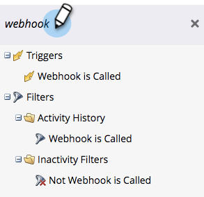

# Utilizzare un webhook in una campagna avanzata {#use-a-webhook-in-a-smart-campaign}

Per utilizzare un [webhook](https://experienceleague.adobe.com/en/docs/marketo-developer/marketo/webhooks/webhooks){target="_blank"}, aggiungilo a una [Smart Campaign](/help/marketo/product-docs/core-marketo-concepts/smart-campaigns/flow-actions/add-a-flow-step-to-a-smart-campaign.md){target="_blank"} come azione di flusso.

>[!AVAILABILITY]
>
>Non tutti gli utenti di Marketo Engage hanno acquistato questa funzionalità. Per informazioni, contatta il team dell’account di Adobe (il tuo Account Manager).

1. [Crea una campagna avanzata](/help/marketo/product-docs/core-marketo-concepts/smart-campaigns/creating-a-smart-campaign/create-a-new-smart-campaign.md){target="_blank"}.

   >[!NOTE]
   >
   >I webhook possono essere utilizzati solo nelle campagne Trigger.

1. Vai alla scheda **[!UICONTROL Flow]** e trascina l&#39;azione di flusso **[!UICONTROL Call Webhook]**.

   

1. Seleziona **[!UICONTROL Webhook]**.

   

1. È inoltre possibile utilizzare i webhook in un elenco avanzato.

   

1. È infine possibile utilizzare i webhook in **[!UICONTROL Add Choice]** in un passaggio di flusso.

   
