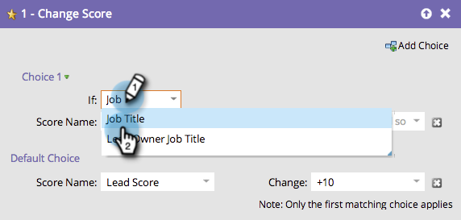

# Usa Aggiungi scelta in un passaggio di flusso {#use-add-choice-in-a-flow-step}

>[!PREREQUISITES]
>
>[Aggiungere un passaggio di flusso a una campagna avanzata](/help/marketo/product-docs/core-marketo-concepts/smart-campaigns/flow-actions/add-a-flow-step-to-a-smart-campaign.md)

**Aggiungi** i tasti di scelta quando usi un passaggio di flusso e dici &quot;Dipende&quot; quando scegli i dettagli.

1. Nella scheda **Flusso** della campagna avanzata, aggiungi qualsiasi passaggio di flusso e fai clic su **Aggiungi scelta**.

   

1. Selezionare la condizione di scelta.

   

1. Scegli l’operatore di scelta e immetti un valore di scelta. Questo imposta i criteri o la scelta dell&#39;utente.

   

1. Immettere un valore per il passo di flusso per la scelta.

   

   >[!CAUTION]
   >
   >I token **non** funzionano nella parte di condizione di un passaggio di flusso di scelta.

1. Ripeti i passaggi precedenti per aggiungere più scelte, quindi aggiungi/regola il valore predefinito.

   

   >[!TIP]
   >
   >Puoi impostare uno qualsiasi dei tuoi passaggi di flusso su —Do Nothing— nel qual caso non verrà intrapresa alcuna azione su quella scelta.

   >[!CAUTION]
   >
   >Al passaggio del flusso viene applicata solo la prima scelta corrispondente. Scopri come [riordinare &quot;Aggiungi scelta&quot; in un&#39;azione di flusso](/help/marketo/product-docs/core-marketo-concepts/smart-campaigns/flow-actions/reorder-add-choice-in-a-flow-step.md).

   Fantastico! È ora possibile creare una singola campagna intelligente con scelte di passaggi di flusso anziché creare più campagne intelligenti per ogni scelta.

   >[!MORELIKETHIS]
   >
   >[Riordinare Aggiungi scelta in un passaggio di flusso](/help/marketo/product-docs/core-marketo-concepts/smart-campaigns/flow-actions/reorder-add-choice-in-a-flow-step.md)
