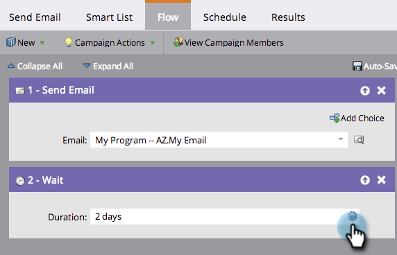

# Utilizzare una durata in un passaggio del flusso di attesa {#use-a-duration-in-a-wait-flow-step}

Puoi utilizzare il passaggio Flusso di attesa per mettere in pausa il percorso di una persona in una campagna intelligente per un certo periodo di tempo. Puoi anche specificare i criteri per il giorno della settimana e l’ora in cui termina.

1. Nella tua campagna intelligente **Flusso** , trascina sulla scheda **Wait** passaggio di flusso.

   

1. Immetti per quanto tempo desideri sospendere l’operazione.

   

1. Tutto qui! Il flusso verrà messo in pausa per la durata specificata. Per opzioni avanzate, fai clic sull’icona a forma di ingranaggio a destra.

   

1. Specifica il giorno della settimana in cui deve terminare il passaggio di attesa.

   

1. Facoltativamente, specifica l’ora. Clic **Salva**.

   

   >[!NOTE]
   >
   >**Esempio**
   >
   >Una persona attiva una campagna intelligente venerdì alle 17. Il passaggio di attesa è avanzato: 48 ore e deve terminare il lunedì-venerdì alle 9.
   >
   >Il risultato sarebbe che la persona avrebbe continuato nel flusso su **Lunedì, ore 9**. Questa è la prima data M-F dopo 48 ore.

   >[!NOTE]
   >
   >La durata, le date, le ore e i giorni utilizzati dipendono dal fuso orario dell’abbonamento.

   >[!MORELIKETHIS]
   >
   >* [Utilizzare una data specifica in un passaggio del flusso di attesa](/help/marketo/product-docs/core-marketo-concepts/smart-campaigns/flow-actions/wait/use-a-specific-date-in-a-wait-flow-step.md)
   >* [Utilizzare un token di data in un passaggio del flusso di attesa](/help/marketo/product-docs/core-marketo-concepts/smart-campaigns/flow-actions/wait/use-a-date-token-in-a-wait-flow-step.md)
