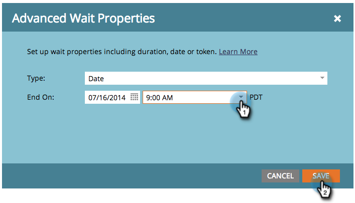

# Utilizzare una data specifica in un passaggio del flusso di attesa {#use-a-specific-date-in-a-wait-flow-step}

È possibile utilizzare **Wait** passaggio di flusso per mettere in pausa il percorso di una persona attraverso una campagna intelligente fino a una data particolare.

1. Nella tua campagna intelligente **Flusso** , trascina sulla scheda **Wait** passaggio di flusso.

   

1. Fai clic sull’icona a forma di ingranaggio a destra.

   

1. Dalla sezione **Tipo** a discesa, seleziona **Data**.

   

1. Seleziona la data specifica in cui desideri riprendere.

   

1. Specifica l’ora (facoltativa) e fai clic su **Salva**.

   

>[!MORELIKETHIS]
>
>* [Utilizzare una durata in un passaggio del flusso di attesa](/help/marketo/product-docs/core-marketo-concepts/smart-campaigns/flow-actions/wait/use-a-duration-in-a-wait-flow-step.md)
>* [Utilizzare un token di data in un passaggio del flusso di attesa](/help/marketo/product-docs/core-marketo-concepts/smart-campaigns/flow-actions/wait/use-a-date-token-in-a-wait-flow-step.md)
