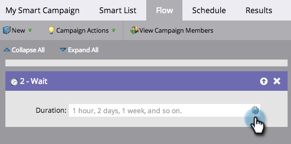
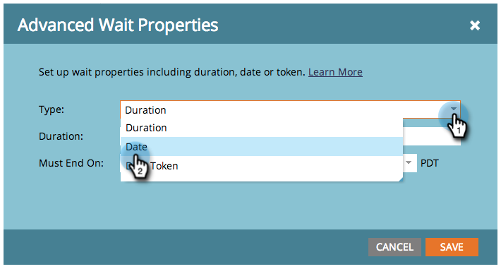

# Utilizzare una data specifica in un passaggio di flusso di attesa {#use-a-specific-date-in-a-wait-flow-step}

Puoi utilizzare il passaggio di flusso "[!UICONTROL Wait]" per mettere in pausa il percorso di una persona in una campagna avanzata fino a una data specifica.

1. Nella scheda **[!UICONTROL Flow]** di Smart Campaign, trascina sul passaggio di flusso **[!UICONTROL Wait]**.

   

1. Fai clic sull’icona a forma di ingranaggio.

   

1. Dall'elenco a discesa **[!UICONTROL Type]**, selezionare **[!UICONTROL Date]**.

   

1. Seleziona la data specifica in cui desideri riprendere.

   

1. Specificare l'ora (facoltativo) e fare clic su **[!UICONTROL Save]**.

   

>[!MORELIKETHIS]
>
>* [Utilizzare una durata in un passaggio del flusso di attesa](/help/marketo/product-docs/core-marketo-concepts/smart-campaigns/flow-actions/wait/use-a-duration-in-a-wait-flow-step.md){target="_blank"}
>* [Utilizzare un token di data in un passaggio del flusso di attesa](/help/marketo/product-docs/core-marketo-concepts/smart-campaigns/flow-actions/wait/use-a-date-token-in-a-wait-flow-step.md){target="_blank"}
