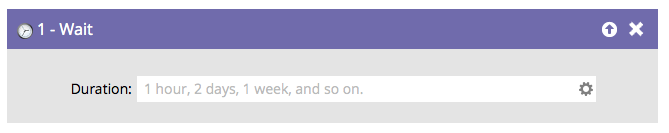

# Panoramica dell’attesa {#wait-overview}

Metti in pausa una persona in un flusso di Smart Campaign con il pratico **passaggio di attesa**.

Osserva come si può digitare in un linguaggio naturale come &quot;4 ore&quot;. **not**, tuttavia, abbreviare le parole (ad esempio, 4 ore). La campagna avanzata verrebbe comunque eseguita, ma il passaggio di attesa verrebbe ignorato.

>[!CAUTION]
>
>La modifica della durata di un passaggio di attesa non avrà effetto sulle persone che vi sono già entrate. Ad esempio: se hai un passaggio di attesa per 5 giorni, un utente lo immette, quindi modifichi il passaggio di attesa in 7 giorni, la persona aspetterà solo i 5 giorni originali prima di passare al passaggio di flusso successivo.

>[!TIP]
>
>Se qualcuno è già in un passaggio di attesa e non vuoi che avanzi dopo il termine del periodo di attesa, inserisci [rimuovi dal flusso](/help/marketo/product-docs/core-marketo-concepts/smart-campaigns/flow-actions/remove-from-flow.md) subito dopo il passaggio di attesa. Specifica chi vuoi rimuovere utilizzando l&#39;opzione [aggiungi scelta](/help/marketo/product-docs/core-marketo-concepts/smart-campaigns/flow-actions/use-add-choice-in-a-flow-step.md).

Esistono tre modi principali per utilizzare un passaggio del flusso di attesa:

1. [Utilizzare una durata in un passaggio di flusso di attesa](/help/marketo/product-docs/core-marketo-concepts/smart-campaigns/flow-actions/wait/use-a-duration-in-a-wait-flow-step.md)
1. [Utilizzare una data specifica in un passaggio di flusso di attesa](/help/marketo/product-docs/core-marketo-concepts/smart-campaigns/flow-actions/wait/use-a-specific-date-in-a-wait-flow-step.md)
1. [Utilizzare un token data in un passaggio di flusso di attesa](/help/marketo/product-docs/core-marketo-concepts/smart-campaigns/flow-actions/wait/use-a-date-token-in-a-wait-flow-step.md)
