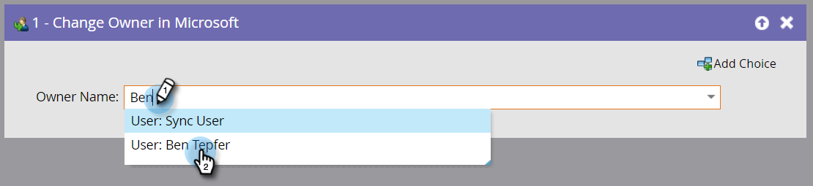

# Cambia proprietario in Microsoft {#change-owner-in-microsoft}

Se esistono persone già assegnate a un proprietario, è possibile utilizzare questo passaggio di flusso per riassegnarle a un altro proprietario.

>[!NOTE]
>
>Questo passaggio di flusso _funziona solo se utilizzato con trigger_, non con filtri, nella tua Smart Campaign.

**Utilizzo**

1. È sufficiente scegliere il proprietario che si desidera cambiare e andare!

   

   >[!NOTE]
   >
   >Se il record non esiste ancora nel tuo account Dynamics, lo sincronizzeremo e lo assegneremo all’utente selezionato.
