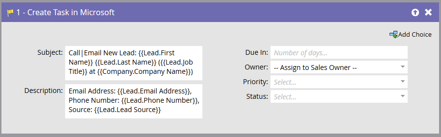
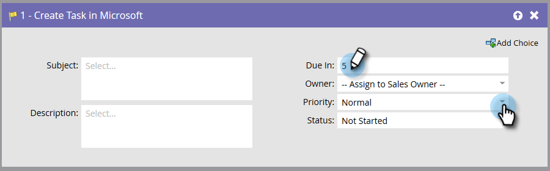

# Creare attività in Microsoft {#create-task-in-microsoft}

In qualità di addetto al marketing, hai a disposizione informazioni che possono essere di aiuto alle vendite per concludere un affare. Puoi creare attività per comunicare loro cosa dovrebbero fare e quando dovrebbero farlo.

Crea attività in Microsoft crea un&#39;attività in Attività relative alla persona (lead o contatto) in [!DNL Microsoft].

>[!NOTE]
>
>Questo passaggio di flusso _funziona solo se utilizzato con trigger_, non con filtri, nella tua campagna avanzata.

Per impostazione predefinita, il passaggio del flusso si presenta così:

>[!NOTE]
>
>Quando l&#39;utente di Marketo Sync crea attività, **[!UICONTROL Due In]** è un campo obbligatorio per la creazione dell&#39;attività in [!DNL Microsoft]. Marketo inserirà cinque giorni per impostazione predefinita se non viene immesso alcun valore.

Personalizzare tutti i campi per creare l&#39;attività nel modo desiderato.

>[!NOTE]
>
>Il campo &quot;Stato&quot; specificato per l&#39;attività nell&#39;azione di flusso aggiorna il campo: &quot;Motivo stato&quot; in [!DNL Microsoft].

>[!TIP]
>
>È possibile utilizzare `{{lead.tokens}}`, `{{company.tokens}}`, `{{campaign.tokens}}` e `{{system.tokens}}` in **[!UICONTROL Subject]** e **[!UICONTROL Description]**. Per ulteriori dettagli, consulta [Token per i passaggi del flusso](/help/marketo/product-docs/core-marketo-concepts/smart-campaigns/flow-actions/use-tokens-in-flow-steps.md){target="_blank"}.
