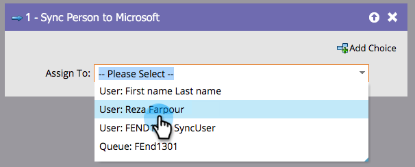

# Sincronizzare persona con Microsoft {#sync-person-to-microsoft}

Questa funzionalità è disponibile solo per coloro che integrano Marketo Engage con [!DNL Microsoft Dynamics].

## Panoramica {#overview}

Questo passaggio di flusso inserirà le persone create da Marketo nel CRM [!DNL Dynamics].

## Utilizzo {#usage}

È possibile impostare un utente [!DNL Dynamics] come proprietario della persona.

>[!NOTE]
>
>Quando si utilizza l&#39;azione di flusso &quot;[!UICONTROL Sync Person to Microsoft]&quot; (solo in una campagna Trigger), il lead/contatto verrà creato in tempo reale in Dynamics.
