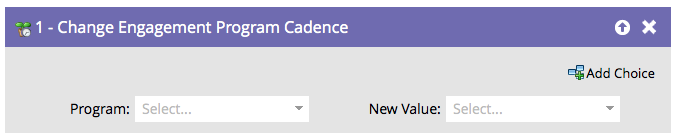

# Modifica cadenza programma di coinvolgimento {#change-engagement-program-cadence}

1. Panoramica

   Una volta che una persona viene nutrita da un programma di coinvolgimento, puoi sospendere temporaneamente lo sviluppo per la persona che utilizza questo passaggio di flusso.

   

   >[!NOTE]
   >
   >Se una persona non è membro del programma ed esegue questo passaggio di flusso, verrà automaticamente aggiunta come membro e nel primo flusso.

## Utilizzo {#usage}

1. Seleziona il programma di coinvolgimento.

   

1. Seleziona **In pausa** come **Nuovo valore** per impedire alla persona di ricevere il contenuto.

   

Puoi reimpostare la persona su **Normale** se desideri che ricomincino a ricevere il contenuto.
